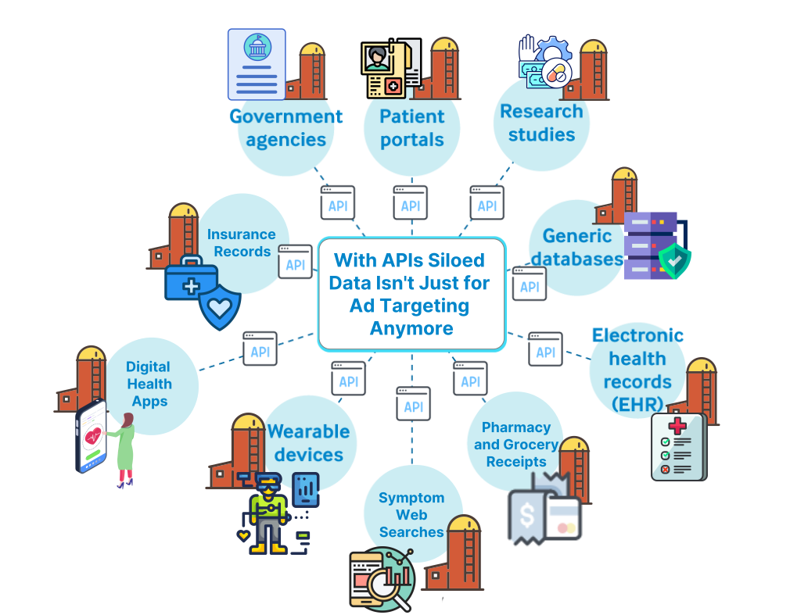
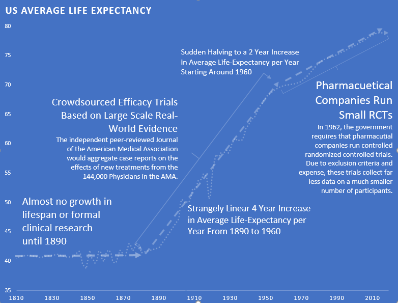
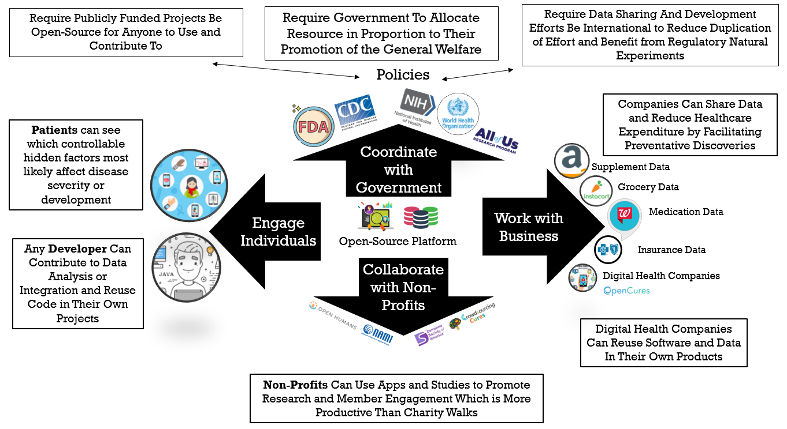

# tl;dr

Anonymous DAO is a decentralized alliance of individuals, government, businesses, and nonprofits devoted to the
minimization of suffering.

To achieve this, we propose the creation of an open-source decentralized health platform
that will produce a massive acceleration of large-scale research to discover new ways to prevent and treat chronic diseases.

It will overcome the traditional barriers to collaboration and data sharing by encoding all data and
intellectual property contributions to the platform in a non-fungible token (NFT). Using smart contracts, the platform will be able to compensate all contributors with royalties for their contributions.

# Join Us Right Now!

Hey, you! 👀

Anonymous DAO is open to anyone interested in alleviating the suffering of chronic diseases. Our success in
this mission will be an exponential function of the participation of people like you. 🚀

Click 👉👉👉 [here](https://github.com/anonymous-dao/draft-whitepaper/discussions/new?category=voters) to tell us about your
interests or project in the [Voters Discussion Channel](https://github.com/anonymous-dao/draft-whitepaper/discussions/categories/voters) and we'll add you to the [voter list](voting.md).

## FAQ

👉 [How can I get involved?](https://github.com/anonymous-dao/draft-whitepaper#how-to-get-started)

👉 [How can I add or edit files?](./how-to/edit-files-in-the-browser.md)

👉 [Why is this called Anonymous DAO](./proposals/dao-name.md)

## How to Get Started

* [Add to or edit the constitution](./how-to/edit-files-in-the-browser.md)
* Decide what goes in the constitution by voting thumbs up 👍 or down 👎 or provide feedback 💬 on changes in the [Pull Requests Tab](https://github.com/anonymous-dao/draft-whitepaper/pulls?q=is%3Apr+is%3Aopen+sort%3Aupdated-desc)
* [Help to prioritize tasks](./how-to/vote-on-tasks-and-sort-by-priority.md)

# 1.    The Problem: You and Everyone You Love Will Suffer and Die

There are over [2 billion](https://www.george-health.com/global-health-challenge/) people suffering from chronic diseases.

Additionally, [150,000](https://www.weforum.org/agenda/2020/05/how-many-people-die-each-day-covid-19-coronavirus/)
people die every single day. For perspective, this is equivalent to:

- **[FIFTY-ONE](https://en.wikipedia.org/wiki/Casualties_of_the_September_11_attacks)** September 11th
  attacks
  every day
- **[NINE](https://en.wikipedia.org/wiki/Casualties_of_the_September_11_attacks)** Holocausts every year

**Will throwing more money at the existing healthcare system save us?**

Since 2014, healthcare spending per person has been [increasing faster than ever](https://fred.stlouisfed.org/series/HLTHSCPCHCSA) faster than ever before.

Despite this additional spending, life expectancy has actually been [declining](./assets/life-expectancy-chart.png)
since 2014.

**Will digital health innovation save us?**

There has been an explosion of recent technological advances in digital health including:

* genetic sequencing
* gut microbiome sequencing
* [350,000](https://www2.deloitte.com/us/en/blog/health-care-blog/2021/how-digital-health-apps-are-empowering-patients.html) digital health apps
* a [billion](https://www.statista.com/statistics/487291/global-connected-wearable-devices/) connected wearable devices

These innovations have produced [50-fold](https://www.weforum.org/agenda/2015/10/who-should-own-our-health-data/) growth in the amount of data on every disease and every factor that could improve, exacerbate, or prevent it.
([chart](./assets/growth-in-health-data-chart.png))

This data exists in the form of:

- Electronic Medical Records
- Nutritional Supplement Purchases
- Data from diet and treatment tracking apps
- Genetic Sequencing
- Health insurance claims
- Grocery, pharmacy, and nutritional supplement receipts
- Clinical trial results

The digital health revolution started over a decade ago. It was promised to improve human health and reduce costs. Yet,
all we've seen is increasing costs, increasing disease burden, and decreasing life expectancy.

**Why haven't we seen a reduction in disease burden?**

So, this explosion in technology, data, and spending has produced no measurable improvement in human health.  The reason, in a single word, is **incentives**. The current economic system punishes every stakeholder in the ecosystem for doing the things that would lead to progress.

## 1.2 Problems in Clinical Research

### 1.2.1 The Cost of Clinical Research

It costs over a [billion dollars](https://www.semanticscholar.org/paper/Innovation-in-the-pharmaceutical-industry%3A-New-of-DiMasi-Grabowski/3275f31c072ac11c6ca7a5260bd535720f07df41) and takes over 10 years to bring a new treatment to market. It
costs [$41k](https://www.clinicalleader.com/doc/getting-a-handle-on-clinical-trial-costs-0001#:~:text=The%20clinical%20trials%20cost%20a,and%20benchmarking%20clinical%20trial%20costs.) per subject in Phase III clinical trials.

This leads to the following problems:

#### No Data on Unpatentable Molecules

We still know next to nothing about the long-term effects of 99.9% of the 4 pounds of over [7,000](https://www.dailymail.co.uk/health/article-8757191/Are-additives-food-making-ill.html) different synthetic or natural chemicals you consume every day.

Under the current system of research, it costs [$41k](https://www.clinicalleader.com/doc/getting-a-handle-on-clinical-trial-costs-0001#:~:text=The%20clinical%20trials%20cost%20a,and%20benchmarking%20clinical%20trial%20costs.) per subject in Phase III clinical trials. As a result, there is not a sufficient profit incentive for anyone to research the effects of any factor besides a molecule that can be patented.

#### Lack of Incentive to Discover the Full Range of Applications for Off-Patent Treatments

There are roughly [10,000](https://www.washingtonpost.com/news/fact-checker/wp/2016/11/17/are-there-really-10000-diseases-and-500-cures/) known diseases afflicting humans, most of which (approximately 95%) are classified as “orphan” (rare) diseases. The current system requires that a pharmaceutical company predict a particular condition in advance of running clinical trials. If a drug is found to be effective for other diseases after the patent has expired, no one has the financial incentive to get it approved for another disease.

#### No Long-Term Outcome Data

Even if there is a financial incentive to research a new drug, there is no data on the long-term outcomes of the drug. The data collection period for participants can be as short as several months.  Under the current system, it's not financially feasible to collect data on a participant for years or decades.  So we have no idea if the long-term effects of a drug are worse than the initial benefits.

For instance, even after controlling for co-morbidities, the Journal of American Medicine recently found that long-term use of Benadryl and other anticholinergic medications is associated with an [increased](https://jamanetwork.com/journals/jamainternalmedicine/fullarticle/2091745) risk for dementia and Alzheimer disease.

### 1.2.2 Conflicts of Interest

Long-term randomized trials are extremely expensive to set up and run. When billions of dollars in losses or gains are riding on the results of a study, this will almost inevitably influence the results. For example, an analysis of beverage studies, [published in the journal PLOS Medicine,](https://web.archive.org/web/20211207021133/https://journals.plos.org/plosmedicine/article?id=10.1371/journal.pmed.1001578#s3) found that those funded by Coca-Cola, PepsiCo, the American Beverage Association, and the sugar industry were **five times** more likely to find no link between sugary drinks and weight gain than studies whose authors reported no financial conflicts.

The economic survival of the pharmaceutical company is dependent on the positive outcome of the trial.  While there's
not a lot of evidence to support that there's any illegal manipulation of results, it leads to two problems:

#### Negative Results are Never Published

Pharmaceutical companies that sponsor research often report only “positive” results, leaving out the non-findings or negative findings where a new drug or procedure may have proved more harmful than helpful. Selective publishing can prevent the rapid spread of beneficial treatments or interventions, but more commonly it means that bad news and failure of medical interventions go unpublished. Past analysis of clinical trials supporting new drugs approved by the FDA showed that just [43 percent of more than 900 trials on 90 new drugs](https://www.livescience.com/8365-dark-side-medical-research-widespread-bias-omissions.html) ended up being published. In other words, about 60 percent of the related studies remained unpublished even five years after the FDA had approved the drugs for market. That meant physicians were prescribing the drugs and patients were taking them without full knowledge of how well the treatments worked.

This leads to a massive waste of money by other companies repeating the same research and going down the same dead-end streets that could have been avoided.

### 1.2.3 Trials Often Aren't Representative of Real Patients

External validity is the extent to which the results can be generalized to a population of interest. The population of interest is usually defined as the people the intervention is intended to help.

Phase III clinical trials are designed to exclude a vast majority of the population of interest. In other words, the subjects of the drug trials are not representative of the prescribed recipients, once said drugs are approved. One investigation found that only [14.5%](https://www.ncbi.nlm.nih.gov/pubmed/14628985) of patients with major depressive disorder fulfilled eligibility requirements for enrollment in an antidepressant efficacy trial.

As a result, the results of these trials are not necessarily generalizable to patients matching any of these criteria:

* Suffer from multiple mental health conditions (e.g. post-traumatic stress disorder, generalized anxiety disorder, bipolar disorder, etc.)
* Engage in drug or alcohol abuse
* Suffer from mild depression (Hamilton Rating Scale for Depression (HAM-D) score below the specified minimum)
* Use other psychotropic medications

These facts call into question the external validity of standard efficacy trials.

Furthermore, patient sample sizes are very small. The number of subjects per trial on average:

* [275](https://www.ncbi.nlm.nih.gov/books/NBK50886/) patients are sought per cardiovascular trial
* [20](https://www.ncbi.nlm.nih.gov/books/NBK50886/) patients per cancer trial
* [70](https://www.ncbi.nlm.nih.gov/books/NBK50886/) patients per depression trial
* [100](https://www.ncbi.nlm.nih.gov/books/NBK50886/) per diabetes trial

### **Solution: Collect Data on Actual Patients**

In the real world, no patient can be excluded. Even people with a history of drug or alcohol abuse, people on multiple medications, and people with multiple conditions must be treated. Only through the crowdsourcing of this research, would physicians have access to the true effectiveness rates and risks for their real-world patients.

The results of crowd-sourced studies would exhibit complete and utter external validity since the test subjects are identical to the population of interest.

Furthermore, self-trackers represent a massive pool of potential subjects dwarfing any traditional trial cohort.
Diet tracking is the most arduous form of self-tracking. Yet, just one of the many available diet tracking apps, **MyFitnessPal,** has 30 million users.

Tracking any variable in isolation is nearly useless in that it cannot provide the causal which can be derived from combining data streams. Hence, this 30 million user cohort is a small fraction of the total possible [stratifiable](https://en.wikipedia.org/wiki/Stratified_sampling) base.

## Criticism of Observational Research

## 1.3 Problems in Digital Health Innovation

### 1.2.1   $157 Billion Wasted on Duplication of Effort

There are more than [350,000](https://www.emarketer.com/content/over-350k-digital-health-apps-flooding-market-here-s-how-apps-stand) health apps. Mobile health app development costs [$425,000](https://www.mobihealthnews.com/content/mobile-health-app-development-costs-425000-average-likely-continuing-rise) on average.  Most of these
have a ton of overlap in functionality representing [$157,500,000,000](https://www.mobihealthnews.com/content/mobile-health-app-development-costs-425000-average-likely-continuing-rise) wasted on duplication of effort.

If this code was freely shared, everyone could build on what everyone else had done could increase the rate of
progress by 350,000 times.

The obstacle has been the free-rider problem. Software Developers that open source their code give their
closed-source competitors an unfair advantage.  This increases their likelihood of bankruptcy even higher than the 90% failure rate they already faced.

#### How DAOs Overcomes the Free-Rider Problem

1. Currently governments around the world are spending billions funding closed-source propriety health software. The
   Public Money Public Code initiative would require governments to recognize software as a [public good](https://en.wikipedia.org/wiki/Public_good_(economics)) and require that publicly-funded software be open source.
2. By encoding contributions to the project with NFTs, we can guarantee ongoing compensation in the
   form of royalties.

### 1.2.2 Isolated Data Silos

The best that isolated data on individual aspects of human health can do is tell us about the past. For example,
dashboards telling us how many steps we got or how much sleep we got are known as “descriptive statistics”.  However,
by integrating all available data from individuals, similar populations, as well as existing clinical research
findings and applying machine learning we may achieve “prescriptive” real-time decision support.

To facilitate data sharing, the DAO will provide data providers with an onsite easily provisionable OAuth2 API server that will allow individuals to anonymously share their data with the global biobank.

# 2. Solution

## Use The Oceans of Real-World Evidence to Discover New Cures

## The Potential of Real-World Evidence-Based Studies

- **Diagnostics** - Data mining and analysis to identify causes of illness
- **Preventative medicine** - Predictive analytics and data analysis of genetic, lifestyle, and social circumstances
  to prevent disease
- **Precision medicine** - Leveraging aggregate data to drive hyper-personalized care
- **Medical research** - Data-driven medical and pharmacological research to cure disease and discover new
  treatments and medicines
- **Reduction of adverse medication events** - Harnessing of big data to spot medication errors and flag potential
  adverse reactions
- **Cost reduction** - Identification of value that drives better patient outcomes for long-term savings
- **Population health** - Monitor big data to identify disease trends and health strategies based on demographics,
  geography, and socioeconomic

## Problems with Historical Observational Research

When people think of observational research, they typically think of correlational association studies.

#### Why It Seems Like Diet Advice Flip-Flops All the Time

In 1977, the USDA warned Americans against the perils of dietary cholesterol. And yet in 1999, TIME released a very different cover, suggesting that dietary cholesterol is fine.

### Correlational is Not The Same as Causation

There are two primary ways of undertaking studies to find out what affects our health:

1. observational studies - the easier of the two options. They only require handing out questionnaires to people about their diet and lifestyle habits, and then again a few years later to find out which habits are associated with different health outcomes.
2. randomized trials - the far more expensive option. Two groups of randomly selected people are each assigned a different intervention.

The largest benefit of randomized trials is that they have the benefit of a "control group". The use of a control
group overcomes the confounding variable problem that plagues observational studies.

A common source of confounding variables in correlational association studies is the "healthy person bias".  For instance, say an observational study finds "People Who Brush Teeth Less Frequently Are at Higher Risk for Heart Disease". It may just be a coincidence caused by a confounding third variable.  People that brush their teeth more are more likely to be generally concerned about their health.  So, the third confounding factor could be that the people without heart disease could also be exercising more or eating better.

However, the massive amount of automatically collected, high-frequency longitudinal data we have today makes it possible for us to overcome the flaws with traditional observational research.

### Overcoming the "No Control Group" Problem

The primary flaw with observational research is that they lack the control group.  The control group consists of the
people who don't receive the intervention or medication in a randomly-controlled trial.  With high-frequency
longitudinal data, a single person can act as their own control group, by using an A/B experiment design.

For instance, if one is suffering from arthritis and they want to know if a Turmeric Curcumin supplement helps, the  experimental sequence would look like this:

1. Month 1: Baseline (Control Group) - No Curcumin
2. Month 2: Treatment (Experimental Group) - 2000mg Curcumin/day
3. Month 3: Baseline (Control Group) - No Curcumin
4. Month 4: Treatment (Experimental Group) - 2000mg Curcumin/day

The more this is done, the stronger the statistical significance of the change from baseline observed. However, there are also effects from other variables, that can be addressed using a diffusion-regression state-space model that predicts the counter-factual response in a synthetic control that would have occurred had no intervention taken place. In contrast to classical difference-in-differences schemes, state-space models make it possible to:

1. infer the temporal evolution of attributable impact
2. incorporate empirical priors on the parameters in a fully Bayesian treatment
3. flexibly accommodate multiple sources of variation, including:
   1. local trends
   2. seasonality
   3. the time-varying influence of contemporaneous covariates

At this time, we apply coefficients representative of each of [Hill’s criteria for causation](http://www.drabruzzi.com/hills_criteria_of_causation.htm) to quantify the likelihood of a causal relationship between two measures as:

* ***Strength Coefficient***: A relationship is more likely to be causal if the correlation coefficient is large and statistically significant.  This is determined through the use of a two-tailed t-test for significance.
* ***Consistency Coefficient***: A relationship is more likely to be causal if it can be replicated.  This value is related to the variation of the average change from baseline for other participants with the same treatment outcome variables in conjunction with the variation in average change from multiple experiments in the same individual.
* ***Specificity Coefficient***: A relationship is more likely to be causal if there is no other likely explanation.  Relationships are calculated based on other potential predictor variables that were available for the individual over the same time period.  The value of the Specificity Coefficient starting at 1 is decreased by the strength of the strongest relationship of all other factors.
* ***Temporality Coefficient***: A relationship is more likely to be causal if the effect always occurs after the cause.
* ***Gradient Coefficient***: The relationship is more likely to be causal if greater exposure to the suspected cause leads to a greater effect. This is represented by the k-means squared difference between the normalized pharmacokinetic time-lagged treatment outcome curves.
* ***Plausibility Coefficient***: A relationship is more likely to be causal if there is a plausible mechanism between the cause and the effect. This is derived from the sum of the crowdsourced plausibility votes on the study.
* ***Coherence***: A relationship is more likely to be causal if it is compatible with related facts and theories. This is also derived from the sum of the crowdsourced plausibility votes on the study.
* ***Experiment Coefficient***: A relationship is more likely to be causal if it can be verified experimentally. This coefficient is proportional to the number of times an A/B experiment is run.
* ***Analogy***: A relationship is more likely to be causal if there are proven relationships between similar causes and effects.  This coefficient is proportional to the consistency of the result for a particular individual with the number of other individuals who also observed a similar effect.

### Meta-Analyses Support of Real-World Evidence

Observational real-world evidence-based studies have several advantages over randomized, controlled trials, including
lower cost, greater timeliness, and a broader range of patients. Concern about inherent bias in these studies,
however, has limited their use in comparing treatments. Observational studies have been primarily used in
situations in which randomized, controlled trials would be impossible or unethical.

However, [meta-analyses](https://www.nejm.org/doi/full/10.1056/NEJM200006223422506) found that:

> when applying modern statistical methodologies to observational studies, the results are generally **not quantitatively or qualitatively different** from those obtained in randomized, controlled trials.

## Evidence in Support of Real-World Evidence

There is compelling historical evidence suggesting that large scale efficacy-trials based on real-world evidence
have ultimately led to better health outcomes than current pharmaceutical industry-driven randomized controlled trials.

For over 99% of recorded human history, the average human life expectancy has been around 30 years.

At the end of the 19th century, the average life expectancy was around 30 years.  

In the late nineteenth and early twentieth century, interest in clinical objectivity grew.  The independent 
peer-reviewed Journal of the American Medical Association (JAMA) was founded in 1893.  It would gather case reports 
from the 144,000 physicians members of the AMA on the safety and effectiveness of drugs. The leading experts in the area of a specific drug would review all of the data and compile them into a study listing side-effect and the conditions for which a drug was or was not effective. If a drug was found to be safe, JAMA would would its seal of approval for conditions it was found to be effective.

The adoption of this system of this crowd-sourced, observational, objective, and peer-reviewed clinical research 
was followed by a sudden shift the growth of human life expectancy.  After over 10,000 years of almost no 
improvement, we suddenly saw a strangely linear 4 year increase in life expectancy every single year.

This consistent 4 year/year increase continued until around 1962 when the growth rate was abruptly cut in half to a 
2 year per year growth rate.  This coincided with the 1962 regulations, it cost a drug manufacturer an 
average of $74 million dollars (2020 inflation-adjusted)
to develop and test a new drug for safety before bringing it to market. Once the FDA had approved it as safe, efficacy testing was performed by the third-party American Medical Association.

The 1962 regulations made these large real-world efficacy trials illegal. Ironically, despite the fact that the new regulations were primarily focused on ensuring that drugs were effective through controlled FDA efficacy trials, they massively reduced the quantity and quality of the efficacy data that was collected for several reasons:
New Trials Were Much Smaller
Were Far More Expensive
Participants Were Less Representative of Actual Patients
They Were Run by Drug Companies with Conflicts of Interest Instead of the 3rd Party AMA

This coincided with the 1962 regulations, it cost a drug manufacturer an
average of $74 million dollars (2020 inflation-adjusted)
to develop and test a new drug for safety before bringing it to market. Once the FDA had approved it as safe, efficacy testing was performed by the third-party American Medical Association.

### An Experiment on Experiments

Validation of the theory that large-scale real-world evidence can produce better health outcomes, will require us to run an experiment to validate this method of experimentation.

## A Black Box Approach to Personalized Medicine

Thus, we can treat the human as a black box and apply predictive
machine learning models to all of the existing real-world data to [stratified groups](https://en.wikipedia.org/wiki/Stratified_sampling) of similar people based on their:

- [Genomic](https://en.wikipedia.org/wiki/Genomics)
- [Metabolomic](https://en.wikipedia.org/wiki/Metabolomics)
- [Microbiomic](https://en.wikipedia.org/wiki/Microbiota)
- [Diseasomic](http://ijream.org/papers/IJREAMV05I0250057.pdf)
- [Pharmacomicrobiomic](https://en.wikipedia.org/wiki/Pharmacomicrobiomics)
- [Pharmacogenomic](https://en.wikipedia.org/wiki/Pharmacogenomics)
- [Foodomic](https://en.wikipedia.org/wiki/Foodomics)

profiles. This will enable us to discover the personalized full range of positive and negative for all factors
without a profit incentive for traditional trials.

## Our Current Research

We publish our anonymously aggregated analyses at the [Journal of Citizen Science](https://app.crowdsourcingcures.org/). So far, we’ve collected over 10
million data points on symptom severity and influencing factors from over 10,000 participants. This data has been
used to publish 90,000 studies on the effects of various treatments and food ingredients on condition severity.

# Platform

The platform will consist of two primary components:

1. **Core Framework** - This will be open-source and include only universally necessary features.  This
   primarily consists of user authentication, data owner access controls, data storage, data validation, and an API
   for storage and retrieval.
   The DAO will compensate contributors to the core platform.
2. **Plugins** - These will be modules that provide additional functionality data import from specific sources, data mapping to various formats, data analysis, data visualization, notifications. These may be free or monetized by their creator.

## Technical Framework

### 1. Data Ingestion API (core component)

Challenge: To acquire, extract, transform, and normalize the countless unstandardized data export file formats and data structures and load them into a standardized structure that can be easily analyzed to derive clinical insight.

Approach: We will develop an application programming interface (API) and OpenAPI specification for receiving and sharing data with the core database.  Software development kits (SDK’s) will be made available for 3rd party applications to use to interact with the API. Plugins will enable spreadsheet upload/import and scheduled imports from existing third-party
APIs.

Impact: The API connector framework will allow the ongoing regular import of user data after a single user authorization.  SDK’s will enable developers to implement easy automatic sharing options in their applications. An increase in the quantity of data will produce a proportional increase in the number of clinical discoveries made.

### 2. Raw Data Storage (core component)

Data will be encrypted stored in its raw format in flat files on a secure cloud provider defined in the
framework instance platform settings.  Preservation of the data in its original format will allow for:

1. Asynchronous Queued Data Parsing Jobs - This is necessary to allow for the data to be parsed in parallel
   offline and avoid overloading the webserver.
2. Storage of data incompatible with a time-series relational data store.
3. Storage of data formats that do not yet have defined parser plugins.  This will allow for the data to be imported
   at a later date when the data mapper has been defined.
4. Updating parsers to support changes in the response format for a particular API.

### 3. Data Mappers (core components and plugins)

These will be executed in an asynchronous queue to map the raw data to a standardized format and provide it to the validator.  The most common data mappers will be defined in the framework. Less common data mappers will be available as plugins from 3rd party developers.

TODO: Determine core data mappers

### 4. Data Validation (core component)

The data validation middleware will validate the data before it is stored in the relational database.  It
will be responsible for ensuring that the data is in a consistent format and that it is not malformed. It
will also ensure that values are within the expected range for a given variable or unit.

### 5. Relational Time Series Data Storage (core component)

After validation and mapping, time-series data will be stored in a relational database.  The use of a
relational data store with defined foreign key relationships will ensure atomicity and data veracity.

### 6. Data Owner Dashboard (core component)

A data owner dashboard will allow them to manage their data and access control settings. It will allow them to:

- view their data and the OAuth clients with access to it
- modify read/write permissions for specific OAuth clients
- restrict access to their data to specific users and groups
- delete data
- view their current compensation balance and make withdrawals
- update their profile information
- configure 2-factor authentication

## Plugin Types

Plugins will be stored in their own repositories based on a plugin template repository.  The plugin template
repository will contain defined interfaces required for interoperability with the core framework.

### 1. Data Analysis Plugins

Challenge: To quantify the effectiveness of treatments for specific individuals, reveal hidden factors exacerbating their illness, and determine personalized optimal daily values for these factors.

Approach: We will develop time-series machine learning algorithms to

- quantify the effect size of all factors on symptom severity
- determine the optimal daily dosage of
  nutrients, sleep, exercise, medications, and other factors necessary to minimize symptom severity.

Impact: This will mitigate the incidence of chronic illnesses by informing the user of symptom triggers, such as dietary sensitivities, to be avoided. This will also assist patients and clinicians in assessing the effectiveness of treatments despite the hundreds of uncontrollable variables in any prescriptive experiment.

### 2. Data Visualization

Data visualization plugin modules will be utilized to visualize the data from a given subject or group in a meaningful
way.  Visualizations may be displayed in studies or on the data owner dashboard.

#### Example Visualizations

Currently, all foods carry nutrition labels such as this one:

But how useful is it to the average person to know the amount of Riboflavin in something? The purpose of nutritional labels is to help individuals make choices that will improve their health and prevent disease.

Telling the average person the amount of riboflavin in something isn’t going to achieve this. This is evidenced by the fact that these labels have existed for decades and during this time, we’ve only seen increases in most diseases they were intended to reduce.

We have created a new and improved **Outcomes Label** that instead lists the degree to which the product is likely
to improve or worsen specific health outcomes or symptoms. We currently have generated Outcome Labels for thousands
of foods, drugs, and nutritional supplements that can be found at [Journal of Citizen Science](https://studies.crowdsourcingcures.org/). These labels are derived from the analysis of 10 million data points anonymously donated by over 10,000 study participants via [our web app](https://app.crowdsourcingcures.org/?swcfpc=1#/app/intro).

#### Data Quantity Required for Outcome Labels

The Foundation has collected over 10 million data points on symptom severity and influencing factors from over 10,000 people. The Foundation develops and applies predictive machine learning algorithms to the data to reveal the effectiveness and side-effects of treatments and the degree to which hidden dietary and environmental improve or exacerbate chronic illnesses

These analytical results have been used to freely publish 90,000 studies on the effects of various treatments and food ingredients on symptom severity.

Although 10 million data points sound like a lot, currently, the usefulness and accuracy of these Outcome Labels are currently limited. This is due to the fact there are only a few study participants have donated data for a particular food paired with a particular symptom. In observational research such as this, a very large number of participants are required to cancel out all the errors and coincidences that can influence the data for a single individual.

For instance, someone with depression may have started taking an antidepressant at the same time they started seeing a therapist. Then, if their depression improves, it’s impossible to know if the improvement was a result of the antidepressant, the therapist, both, or something else. These random factors are known as confounding variables. However, random confounding factors can cancel each other out when looking at large data sets. This is why it’s important to collect as much data as possible.

#### Data Sources for Outcome Labels

Several types of data are used to derive the Outcome Labels:

1. **Individual Micro-Level Data** – This could include data manually entered or imported from other devices or apps
   in [our app](http://app.crowdsourcingcures.org/?swcfpc=1), This could also include shopping receipts for foods,
   drugs, or nutritional supplements purchased and insurance claim data.
2. **Macro-Level Epidemiological Data** – This includes the incidence of various diseases over time combined with data on the amounts of different drugs or food additives. This is how it was initially discovered that smoking caused lung cancer. With macro-level data, it’s even harder to distinguish correlation from causation. However, different countries often enact different policies that can serve as very useful natural experiments. For instance, 30 countries have banned the use of glyphosate. If the rates of Alzheimer’s, autism, and depression declined in these countries and did not decline in the countries still using glyphosate, this would provide very powerful evidence regarding its effects. Unfortunately, there is no global database that currently provides easy access to the incidence of these conditions in various countries over time and the levels of exposure to various chemicals.
3. **Clinical Trial Data** – This is the gold standard with regard to the level of confidence that a factor is truly the cause of an outcome. However, it’s also the most expensive to collect. As a result, clinical trials are often very small (less than 50 people). Exclusion criteria in trials often prevent study participants from being representative of real patients. There are ethical considerations that prevent us from running trials that have any risk of harm to participants. Due to the expense involved, we have very few trials run on anything other than a molecule that can be patented and sold as a drug.

### 3. API Connectors

API Connector plugins will be called by the webserver to:

1. handle the OAuth2 authorization flow and store their credentials in the relational database
2. provide the original raw response to the framework for encryption and storage

A job scheduler will call the API connectors periodically (usually daily) to:

1. Refresh the user's OAuth access token
2. Fetch new data or data that has been modified since the last import
3. Map the response to the standard format as defined by the OpenAPI specification for the framework API
4. Provide the processed data to the framework's validation middleware.
5. All valid data will be stored in the relational database. Otherwise, the data will be rejected and the plugin developer and data owner will be notified.

### 4. Spreadsheet and PDF Importers

Upon upload, the webserver will call the File Importer plugin:

1. Provide the original file to the framework for encryption and storage
2. Add the file to a queue for processing by the job scheduler
   The background job scheduler will:
3. Retrieve the file from the encrypted storage
4. Extract the data from the file
5. Mapped to the standard format as defined by the framework OpenAPI specification
6. The processed data will be provided to the framework's validation middleware.
7. Valid data will be stored in the relational database.
8. Invalid data from the plugin will be rejected and the plugin developer and data owner will be notified.

# Incentive Alignment

Fully realizing the potential of the personalized preventative medicine of the future will require incentivizing cooperation between the following stakeholders:

## 1. Patients

Incentives for Patients to share their de-identified data will include:

1. Actionable ways to prevent and mitigate chronic illnesses.
2. The ability to license and earn a share of income for use of their data for research and development by
   pharmaceutical companies and other businesses.  This will be achieved by encoding the user data using
   non-fungible tokens (NFTs) and issuing them to the user.  The NFTs will be linked to the user's cryptographic wallet address.  Using a smart contract, the user will receive an ongoing royalty share of the profits for any product that was developed using their data for research and development.
3. TODO: Determine the amount of reward for sharing.

## 2. Businesses Housing Data Silos

Businesses housing data silos include health insurers, pharmacies, grocery delivery services, digital health
apps, hospitals, etc. These will be incentivized to allow individuals to easily share their data via a well-documented
OAuth2 API by:

1. A share of income for use of their data for research and development.
2. An on-site instance of the OAuth2 server to retrieve required data from their on-premise databases.
3. An eventual reduction in their employee healthcare costs (one of their largest expenses) by resulting from the discovery of new ways to prevent and mitigate chronic illnesses.

## 4. Digital Health Businesses

On top of the incentives for businesses listed above, the following incentives will be provided to digital health businesses which enable data sharing:

1. A license to use a white-labeled version of the framework.  This will dramatically reduce the costs of software development. These reduced costs will allow them to focus on innovating their unique value proposition, making them more competitive in the market.

## 5. Disease Advocacy Non-Profit Organizations

Disease advocacy non-profits will be incentivized to promote observational studies
through the anonymous donation data by their members by:

1. Accelerated furtherance of their mission to reduce the incidence of chronic illnesses.
2. A new method of member engagement more motivating and productive than the traditional charity walk.

## 6. Government Health Agencies

Governments will be incentivized by:

1. A reduction in government healthcare costs due to the discovery of new ways to prevent and mitigate chronic illnesses.
2. Furtherance of their stated reason for existence to protect and promote the general welfare.
   General welfare is defined as the overall health and happiness of the population.
3. Their duty to protect the rights of individuals' data. To fulfill this, they must require businesses in
   possession of it to give them the ability to access and share their data via a well-documented OAuth2 API
4. Cost-savings from using open-source software.  All publicly funded digital-health software projects should be free, secure, and open-source. Currently, the majority of government contracts go to closed-source and proprietary software.  This leads to massive waste as governments around the world are paying to reinvent the wheel instead of sharing the costs. Shockingly, there is even a great deal of wasted money on duplicated software contracts between different agencies within the same governments.
5. Require international cooperation for all public health efforts to reduce wasted duplication of effort and take advantage of natural experiments resulting from differing public health regulations between nations.
6. Epidemiological discoveries from allowing citizens to anonymously share their data in a global database.  This will enable us to take advantage of natural experiments resulting from differing public health regulations between nations.  For instance, 27 countries have banned the use of the pesticide glyphosate due to concerns about the health effects.  If no overall change in the health of the populations is observed, it will suggest that the health concerns may be unfounded.

## 7. Contributors to the Development of the Platform

Members of the DAO will be incentivized to contribute to the development of the platform by:
TODO: Determine amount and type of reward for contributing to the development of the platform by voting here 👉 Vote on the Amount of Token Compensation for Specific Tasks

## 8. Compensation

Compensation for various tasks will be determined democratically by voting here 👉 [Vote on the Amount of Token Compensation for Specific Tasks](https://docs.google.com/forms/d/1zNRRLEOnrQmlbKu33NORJQDktJhgneQHsQtJHW3erL0/edit)

# Privacy

The Health Insurance Portability and Accountability Act of 1996 (“HIPAA”) protects the privacy of patients and sets forth guidelines on how this private health information can be shared.  Though the privacy of a patient must be protected, the legal right of a business to sell health information of patients has been upheld by the Supreme Court of the United States.

## Safe Harbor Method of De-identification

The HIPAA Safe Harbor Method is a precise standard for the de-identification of personal health information when
disclosed for secondary purposes.  It requires the removal of 18 identifiers from a dataset:

1. Names
2. All geographical subdivisions smaller than a State, including street address, city, county, precinct, zip code, and their equivalent geocodes, except for the initial three digits of a zip code, if according to the current publicly available data from the Bureau of the Census:
   1. The geographic unit formed by combining all zip codes with the same three initial digits contains more than 20,000 people and
   2. The initial three digits of a zip code for all such geographic units containing 20,000 or fewer people is changed to 000.
3. All elements of dates (except year) for dates directly related to an individual, including birth date, admission date, discharge date, date of death and all ages over 89 and all elements of dates (including year) indicative of such age, except that such ages and elements may be aggregated into a single category of age 90 or older
4. Phone numbers
5. Fax numbers
6. Electronic mail addresses
7. Social Security numbers
8. Medical record numbers
9. Health plan beneficiary numbers
10. Account numbers
11. Certificate/license numbers
12. Vehicle identifiers and serial numbers, including license plate numbers
13. Device identifiers and serial numbers
14. Web Universal Resource Locators (URLs)
15. Internet Protocol (IP) address numbers
16. Biometric identifiers, including finger and voice prints
17. Full face photographic images and any comparable images and
18. Any other unique identifying number, characteristic, or code (note this does not mean the unique code assigned by the investigator to code the data).

# Sources

1. [Infographic: How Big Data Will Unlock the Potential of Healthcare](https://www.visualcapitalist.com/big-data-healthcare/)
2. [George Health Global Health Challenge](https://www.george-health.com/global-health-challenge/) - Pioneering life-saving treatments for people suffering from chronic diseases.
3. [HealthVerity Census - HealthVerity](https://healthverity.com/solutions/healthverity-census/) - De-identification of health data and re-linkage to an anonymous identifier for analysis.
4. [Health Expenditures per Capita](https://fred.stlouisfed.org/series/HLTHSCPCHCSA)
5. [List of countries by total health expenditure per capita](https://en.wikipedia.org/wiki/List_of_countries_by_total_health_expenditure_per_capita)
6. [Healthcare Big Data and the Promise of Value-Based Care](https://catalyst.nejm.org/doi/full/10.1056/CAT.18.0290)
7. [PDX and Personalized Medicine](https://blog.crownbio.com/pdx-personalized-medicine#_)
8. [Healthcare Big Data and the Promise of Value-Based Care (nejm.org)](https://catalyst.nejm.org/doi/full/10.1056/CAT.18.0290)
9. [Fifty Years of Progress in Chronic Disease Epidemiology and Control (cdc.gov)](https://www.cdc.gov/mmwr/preview/mmwrhtml/su6004a12.htm)
10. [The Problem with Observational Studies (Epidemiology)](https://www.jeffnobbs.com/posts/the-problem-with-observational-studies-epidemiology)
11. [Flat Icons](https://www.flaticon.com/packs/flat-icons)
12. [Why Does the Federal Government Issue Damaging Dietary Guidelines?](https://www.cato.org/policy-analysis/why-does-federal-government-issue-damaging-dietary-guidelines-lessons-thomas#why-did-the-senate-select-committee-launch-an-attack-on-fats)
13. [Big fat controversy: changing opinions about saturated fats](https://www.aocs.org/stay-informed/inform-magazine/featured-articles/big-fat-controversy-changing-opinions-about-saturated-fats-june-2015?SSO=True)
14. [Bytes to Bucks: The Valuation of Data - HealthCare Appraisers](https://healthcareappraisers.com/bytes-to-bucks-the-valuation-of-data/)
15. [Berwick, Donald M.; Nolan, Thomas W.; and Whittington, John. “The Triple Aim: Care, Health, and Cost.”   
    *Health Affairs*: Vol. 27, No. 3. May/June 2008.  Retrieved May 1, 2019](https://www.healthaffairs.org/doi/full/10.1377/hlthaff.27.3.759)
16. [health data. (n.d.)  *McGraw-Hill Concise Dictionary of Modern Medicine*. (2002). Retrieved May 1, 2019](https://medical-dictionary.thefreedictionary.com/health+data)
17. [William H. Sorrell, Attorney General of Vermont, Et Al., Petitioners v. IMS Healthcare Inc. ET Al.](https://www.oyez.org/cases/2010/10-779)
18. [https://www.federalregister.gov/d/2019-08530](https://www.federalregister.gov/d/2019-08530)
19. [https://compliancy-group.com/hipaa-fines-directory-year/](https://compliancy-group.com/hipaa-fines-directory-year/)
20. 45 CFR § 164.514 (b)(1)(i); As set forth in the HIPAA Privacy Rule
21. https://www.bloomberg.com/graphics/infographics/reidentifying-anonymous-medical-records.html
22. Na L, Yang C, Lo C, Zhao F, Fukuoka Y, Aswani A. Feasibility of Reidentifying Individuals in Large National Physical Activity Data Sets From Which Protected Health Information Has Been Removed With Use of Machine Learning; [https://jamanetwork.com/journals/jamanetworkopen/fullarticle/2719130
23. [https://california.public.law/codes/ca_bus_and_prof_code_section_650
24. https://www.nytimes.com/2018/09/20/health/memorial-sloan-kettering-cancer-paige-ai.html
25. [NC233 causal inference](https://nc233.com/tag/causal-inference/)
26. [Inferring causal impact using Bayesian structural time-series models](https://storage.googleapis.com/pub-tools-public-publication-data/pdf/41854.pdf)
27. [CausalImpact R Package](http://google.github.io/CausalImpact/CausalImpact.html)

### License

 This work is licensed under a <a rel="license" href="http://creativecommons.org/licenses/by-nc-sa/4.0/">Creative Commons Attribution-NonCommercial-ShareAlike 4.0 International License</a>.
