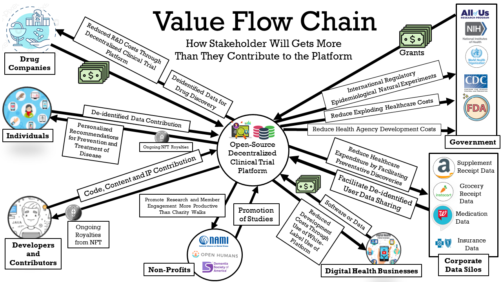
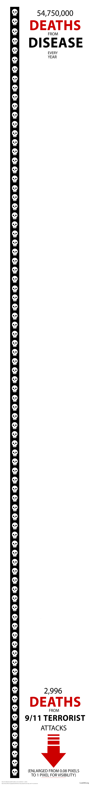
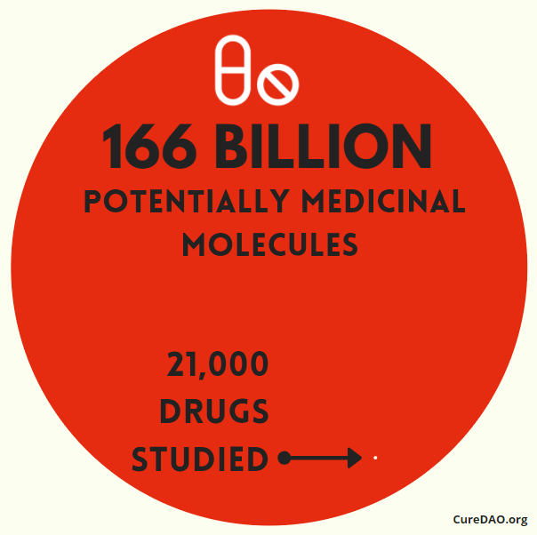
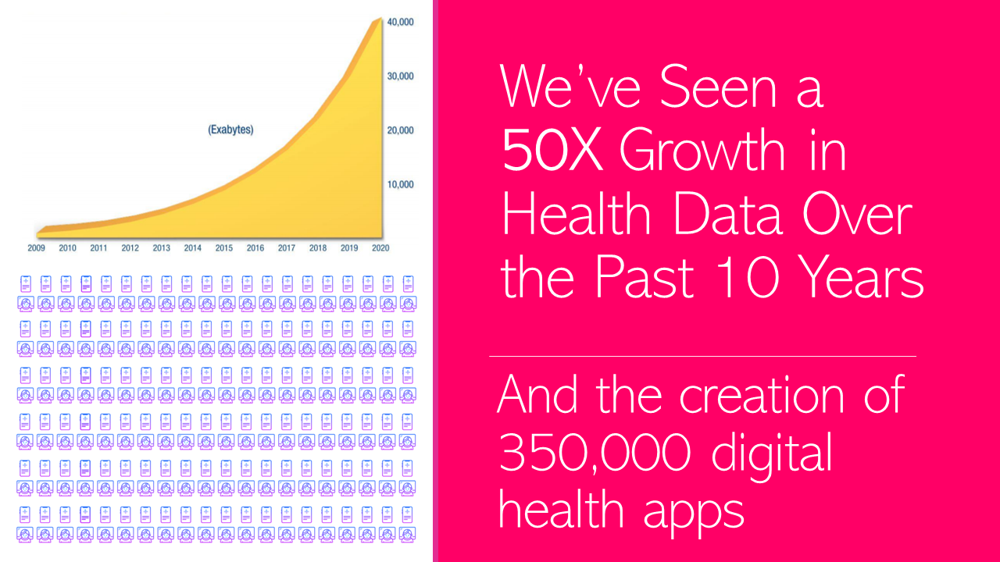
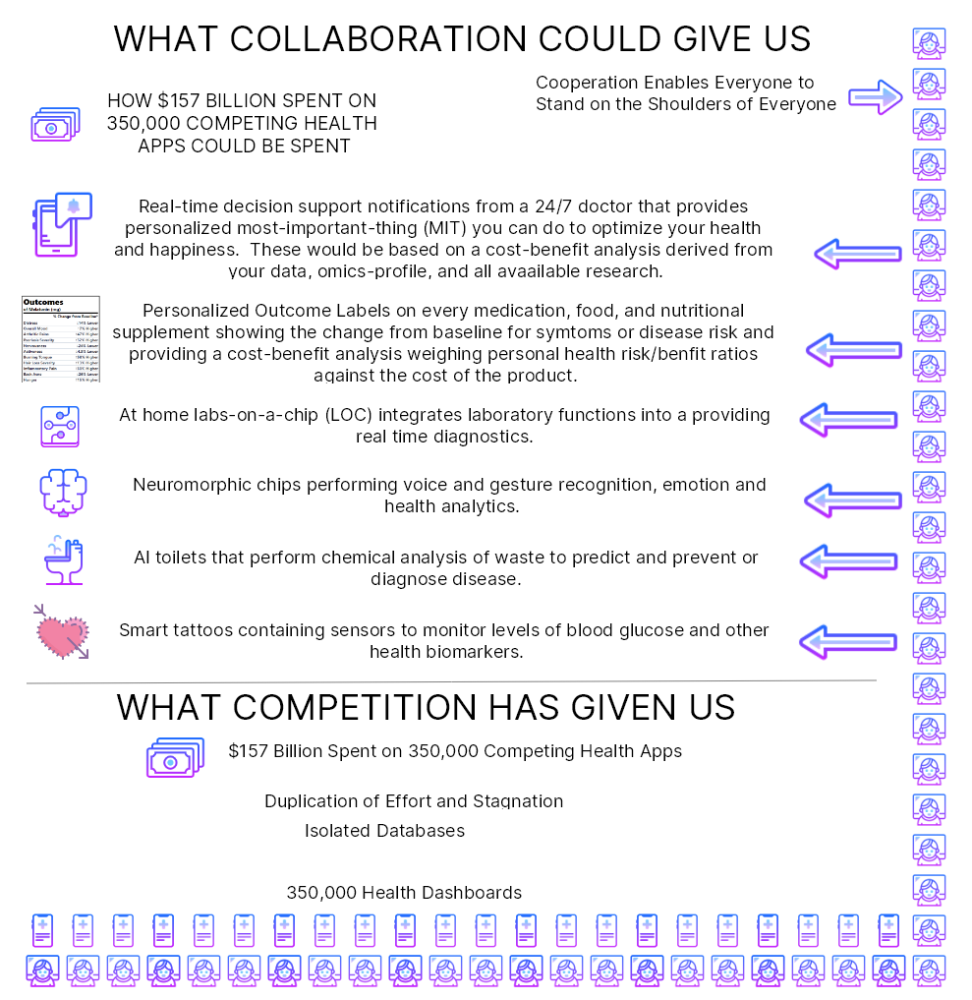
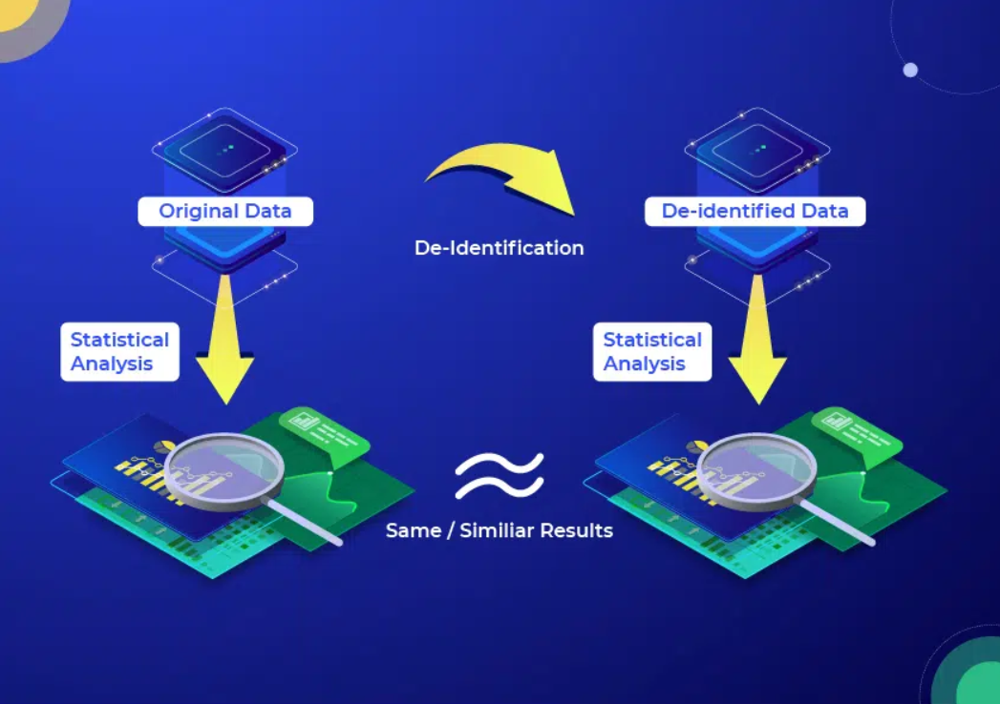

## tl;dr

CureDAO is a decentralized autonomous organization (DAO) of citizen scientists, governments, businesses, and
nonprofits devoted to the minimization of suffering.

To achieve this, we propose the creation of an open-source framework that overcomes the traditional economic barriers to cooperation and data-sharing in the field of digital health.

It consists of two primary components:

1. An Open-Source Platform for Health Data:
   1. Storage
   2. Security
   3. Access Control
   4. De-identified Data Sharing
2. An Open Plugin Ecosystem enabling anyone to create or use plugins that facilitate:
   1. Import from any application, wearable device, or other data source
   2. New Clinical Discoveries through Machine Learning
   3. Personalized Real-Time Decision Support Informing Individuals of the Most Effective things they can do to treat and prevent disease
   4. Data format transformation to enable interoperability with any system or application
   5. Patient Management
   6. Decentralized Clinical Trial Management
   7. Precision Medicine
   8. Large-scale, low-cost research to discover new ways to prevent and treat chronic diseases

It will overcome the traditional barriers to collaboration and data sharing by encoding all data and intellectual property contributions to the platform in a non-fungible token (NFT). Using smart contracts, the platform will be able to compensate all contributors with royalties for their contributions.

## Join Us Right Now

Hey, you! 👀

CureDAO is open to anyone interested in preventing suffering and death from chronic diseases and degenerative diseases. Our success in this mission will be an exponential function of the participation of people like you. 🚀

Creating a new software ecosystem for health data not only requires developers but anyone with skills in:

* user interface and user experience design
* project management
* communications and marketing
* web3 technologies
* business development
* life sciences
* medicine
* data science

Our main philosophy is: It's not what you CAN do but what do you WANT to do is what counts.

#### 👉 [How To Get Involved](https://docs.curedao.org/how-to)

## Whitepaper

1. [Introduction and Challenges](constitution/1-introduction-and-challenges.md)
2. [Solution](constitution/2-solution.md)
3. [Platform](constitution/3-platform.md)
4. [Incentivization](constitution/4-incentivization.md)
5. [Organization](constitution/5-organization.md)
6. [Tokenomics](constitution/6-tokenomics.md)
7. [Revenue](constitution/7-revenue.md)
8. [Legal Framework](constitution/8-legal-framework.md)
9. [Privacy](constitution/9-privacy.md)
10. [Ecosystem](constitution/10-ecosystem.md)
11. [Roadmap](constitution/11-roadmap.md)
12. [References](constitution/12-references.md)

# 💡 Litepaper

# The Problem: You and Everyone You Love Will Suffer and Die

[150,000](https://www.weforum.org/agenda/2020/05/how-many-people-die-each-day-covid-19-coronavirus/) people die every single day by preventable degenerative diseases.
For perspective, this is equivalent to:

* [**FIFTY-ONE**](https://en.wikipedia.org/wiki/Casualties\_of\_the\_September\_11\_attacks) September 11th attacks every day
* [**NINE**](https://www.haaretz.com/israel-news/6-million-where-is-the-figure-from-1.10570907) Holocausts every year

Over [2 billion](https://www.george-health.com/global-health-challenge/) people are suffering from chronic diseases.

## What We Don't Know

We’re only two lifetimes from the use of the modern scientific method in medicine.
Thus it's only been applied for 0.0001% of human history.
The more clinical research studies we read, the more we realize we don’t know.
Nearly every study ends with the phrase "more research is needed".

There are over [7,000](https://www.washingtonpost.com/news/fact-checker/wp/2016/11/17/are-there-really-10000-diseases-and-500-cures/) known diseases afflicting humans.
There are as many untested compounds with drug-like properties as there are [atoms in the solar system](https://www.nature.com/articles/549445a) (166 billion).
If you multiply the number of molecules with drug-like properties by the number of diseases, that's 1,162,000,000,000,000 combinations.
So far we've studied [21,000 compounds](https://www.centerwatch.com/articles/12702-new-mit-study-puts-clinical-research-success-rate-at-14-percent).
That means we only know 0.000000002% of what is left to be known.

### The Cost of Clinical Research

It takes over 10 years and [$2.6 billion](https://www.semanticscholar.
org/paper/Innovation-in-the-pharmaceutical-industry%3A-New-of-DiMasi-Grabowski/3275f31c072ac11c6ca7a5260bd535720f07df41) to bring a drug to market (including failed attempts).

 [source: clinicalresearch.io](https://www.clinicalresearch.io/blog/industry-trends/cost-of-clinical-trials-breakdown/)

This high cost leads to the following problems:

#### 1. No Data on Unpatentable Molecules

We still know next to nothing about the long-term effects of 99.9% of the 4 pounds of over [7,000](https://www.dailymail.co.uk/health/article-8757191/Are-additives-food-making-ill.html) different synthetic or natural chemicals you consume every day.

Under the current system of research, it costs [$41k](https://www.clinicalleader.com/doc/getting-a-handle-on-clinical-trial-costs-0001#:\~:text=The%20clinical%20trials%20cost%20a,and%20benchmarking%20clinical%20trial%20costs.) per subject in Phase III clinical trials. As a result, there is not a sufficient profit incentive for anyone to research the effects of any factor besides a molecule that can be patented.

#### Lack of Incentive to Discover the Full Range of Applications for Off-Patent Treatments

There are roughly [10,000](https://www.washingtonpost.com/news/fact-checker/wp/2016/11/17/are-there-really-10000-diseases-and-500-cures/) known diseases afflicting humans, most of which (approximately 95%) are classified as “orphan” (rare) diseases. The current system requires that a pharmaceutical company predict a particular condition in advance of running clinical trials. If a drug is found to be effective for other diseases after the patent has expired, no one has the financial incentive to get it approved for another disease.

#### No Long-Term Outcome Data

Under the current system, it's not financially feasible to collect data on a participant for years or decades. So we have no idea if the long-term effects of a drug are worse than the initial benefits.

#### Negative Results are Never Published

Pharmaceutical companies that sponsor research often report only “positive” results. This leads to a massive waste of money by other companies repeating the same research and going down the same dead-end streets that could have been avoided.

#### Trials Often Aren't Representative of Real Patients

Phase III clinical trials are designed to exclude a vast majority of the population of interest. One investigation found that only [14.5%](https://www.ncbi.nlm.nih.gov/pubmed/14628985) of patients with major depressive disorder fulfilled eligibility requirements for enrollment in an antidepressant efficacy trial.
Furthermore, patient sample sizes are very small and sometimes include as few as 20 people.

# Problems in Digital Health Innovation

### 1. Wasted Duplication of Effort

There has been an explosion of recent technological advances in digital health, including 350,000 new digital health apps.  
These innovations have produced a [50-fold](https://www.weforum.org/agenda/2015/10/who-should-own-our-health-data/)
growth in the amount of data on every disease and every factor that could improve, exacerbate, or prevent it.

Despite this growth, all we've seen is increasing costs, increasing disease burden, and decreasing life expectancy.

The reason, in a single word, is **incentives**. The current economic system punishes every stakeholder in the ecosystem for doing the things that would lead to progress.

The best that isolated data on individual aspects of human health can do is tell us about the past. For example, dashboards telling us how many steps we got or how much sleep we got are known as “descriptive statistics”.

However, by integrating all available data from individuals, similar populations, and existing clinical research findings and applying machine learning, we may achieve “prescriptive” real-time decision support.

There are more than [350,000](https://www.emarketer.com/content/over-350k-digital-health-apps-flooding-market-here-s-how-apps-stand) health apps. Mobile health app development costs [$425,000](https://www.mobihealthnews.com/content/mobile-health-app-development-costs-425000-average-likely-continuing-rise) on average.
Most of these have significant overlap in functionality representing [$157,500,000,000](https://www.mobihealthnews.com/content/mobile-health-app-development-costs-425000-average-likely-continuing-rise) wasted on duplication of effort.
If this code was freely shared, everyone could build on what everyone else had done.
Theoretically, this could increase the rate of progress by 350,000 times.

The obstacle has been the free-rider problem. Software Developers that open source their code give their closed-source competitors an unfair advantage.  This increases their likelihood of bankruptcy even higher than the 90% failure rate they already faced.

### 2. Isolated Data Silos

To facilitate data sharing, the CureDAO will provide data providers with an onsite, easily provisionable OAuth2 API server that will allow individuals to share their data with the global biobank anonymously.

#### Solution: How DAOs Overcomes the Free-Rider Problem

1. Currently, governments worldwide are spending billions funding closed-source propriety health software.
   The Public Money, Public Code initiative, would require governments to recognize software as a [public good](https://en.wikipedia.org/wiki/Public_good_(economics)) and require that publicly-funded software be open source.
2. By encoding contributions to the project with NFTs, we can guarantee ongoing compensation for data and software in
   the form of royalties.

# 💡 Solution

The solution to the lack of progress and increasing healthcare expense is to use the oceans of real-world evidence to discover new cures.

### The Personalized, Preventive, Precision Medicine of the Future

Out of an existing pool of big health data, an insilico model of human biology can be developed to discover new interventions and their personalized dosages and combinations.

One way to achieve this is to view the human body as a black box with inputs and outputs.
We can apply [predictive machine learning models](plugins/optomitron-real-time-decision-support-plugin/optomitron-real-time-notifications-plugin.md) to [stratified groups](https://en.wikipedia.org/wiki/Stratified\_sampling)
of similar people based on their data of their following profiles:

* [Genomic](https://en.wikipedia.org/wiki/Genomics)
* [Transcriptomic](https://en.wikipedia.org/wiki/Transcriptome)
* [Proteomic](https://en.wikipedia.org/wiki/Proteomics)
* [Metabolomic](https://en.wikipedia.org/wiki/Metabolomics)
* [Microbiomic](https://en.wikipedia.org/wiki/Microbiota)
* [Phenotype](https://en.wikipedia.org/wiki/Phenotype)
* [Diseasomic](http://ijream.org/papers/IJREAMV05I0250057.pdf)
* [Pharmacomicrobiomic](https://en.wikipedia.org/wiki/Pharmacomicrobiomics)
* [Pharmacogenomic](https://en.wikipedia.org/wiki/Pharmacogenomics)
* [Foodomic](https://en.wikipedia.org/wiki/Foodomics)
* [Exposome](https://en.wikipedia.org/wiki/Environmental\_factor#Exposome)

This will enable the discovery of the full personalized range of positive and negative relationships for all factors without a profit incentive for traditional trials.

### The Potential of Real-World Evidence-Based Studies

* **Diagnostics** - Data mining and analysis to identify causes of illness
* **Preventative medicine** - Predictive analytics and data analysis of genetic, lifestyle, and social circumstances to prevent disease
* **Precision medicine** - Leveraging aggregate data to drive hyper-personalized care
* **Medical research** - Data-driven medical and pharmacological research to cure disease and discover new treatments and medicines
* **Reduction of adverse medication events** - Harnessing of big data to spot medication errors and flag potential adverse reactions
* **Cost reduction** - Identification of value that drives better patient outcomes for long-term savings
* **Population health** - Monitor big data to identify disease trends and health strategies based on demographics, geography, and socioeconomic

# 🏭 Platform

A global open-source platform and plugin framework will enable the transformation of data into clinical discoveries.

### Functional Scope
The functional scope of the platform includes:
- aggregation
- managing
- processing
- storage

of health data from different sources.

### Primary goal
Create a basic foundational technology layer suitable for any digital health application providing better interoperability, portability, availability, analysis, security of the data.

### Use Cases
* EHR Systems for healthcare providers
* User-centered dashboards for personal health management
* Data sharing with doctors, health coaches, or family members
* Decentralized clinical trial platforms (e.g. BYOD wearable)
* Patient recruitment services for clinical trials
* Citizen science platforms
* Health data marketplaces
* Open health databases for research
* Algorithm and scores development (e.g. in-silico trials)
* Niche health applications with specific requirements or custom integrations

The platform consists of two primary components:

* **Core Open-Source Platform** - The core platform is open-source and includes only universally necessary features.
  This primarily consists of user authentication, data owner access controls, data storage, data validation, and an API for storage and retrieval. The DAO will compensate contributors to the core platform.
* **Plugin Framework** - Plugins are modules that provide additional functionality.
  This includes data import from specific sources, data mapping to various formats, data analysis, data visualization, notifications.
  These may be free or monetized by their creator or even be integrated into the core based on community voting.

### Core Components

#### Data Ingestion API

The application programming interface (API) includes an OpenAPI specification for receiving and sharing data with the
core database.
Software development kits (SDK’s) made available for 3rd party applications allow the interaction with the API.
SDK’s will enable developers to implement easy automatic sharing options in their applications.

Separate plugins will enable spreadsheet upload/import and scheduled imports from existing third-party APIs.
The API connector framework will allow the ongoing regular import of user data after a single user authorization.

#### Data Sources

* Laboratory and Home tests (Standard Blood panels, Metabolomics, Proteomics, Genetics, Urinalysis, Toxins, etc)
* Wearable (Sleep and Fitness trackers, etc)
* Health apps (Meal tracking, Fertility, etc)
* User reported symptoms and intervention application
* Electronic Heath Records
* Imaging
* Questionnaires
* Functional tests
* Environmental and context data (Twosome)
* Life events, Calendar, Social media, and Lifestyle
* Digital biomarkers
* Location

#### Data Formats

* FHIR
* openEHR
* LOINC
* SNOMED
* RXNORM
* MedDRA
* ICD-10
* Open mHealth

#### Raw Data and Files Storage

To preserve originality in case of data processing errors or protocol changes the ingested raw files like CSV files, PDF reports, and the raw API responses are stored separately in a binary data and file storage system.
Data will be encrypted and stored in its raw format in flat files on a secure cloud provider defined in the framework instance platform settings.

#### Data Mapping

To make the standardized structured storage of health data and the envisioned queries possible, the data has to be ingested from files or API requests and mapped from many different standards and proprietary formats into a standard schema.

#### Data Validation

The data validation middleware will validate the data before it is stored in the time-series database.

#### Reference Data Definitions

Mapping data from different formats into one standardized format suitable for a analysis requires a reference database with tables of definitions and descriptions to be used by the data mappers and by the API for displaying this information in applications.
The includes biomarkers, health-related variables of any kind, interventions, therapies, outcomes, conditions, etc.
Examples of reference databases include LOINC, RXNORM, and ICD-10.

##### Units of Measurement

The Unified Code for Units of Measure (UCUM) system will be used to
include all units of measures being contemporarily used in international science.  The full list of units of measure is available [here](reference-databases/units/ucum_units_of_measure.csv).

#### Time Series Data Storage

After validation and mapping, the data will be stored in a standardized and structured time-series database.

#### Data Ownership

Data should be owned by the individual who generated it.
It should remain under their control throughout the entire data life-cycle from generation to deletion.
The data owner shall have the unrestricted ability to manage their digital health identity.

Ownership management functionalities will allow the individual to manage their data and access control settings for sharing purposes.
It will allow them to:

* View and Access their data
* View the OAuth clients with access to the data
* Modify read/write permissions for specific OAuth clients
* Restrict data access to specific users, groups, researchers, or applications
* Restrict data access to specific data categories, types, and markers
* Restrict time and expiration of data access
* Configure security measures such as encryption or 2-factor authentication
* Overview of statistics of data (amount, averages, sources, etc..)
* Export stored data or the original files
* Delete data

This feature can be used by user-centered applications and dashboards for personal health management, for data sharing with care providers, research, or for participation in trials.

#### Data Compensation

Health data is a sensitive and valuable commodity.Therefore the handling of the data alongside its attached value is proposed to be built natively into the core.
Value stream management functionalities will allow the exchange from data against tokenized value assets in different scenarios.
It will allow:

* Individuals to share data and receive defined compensation
* Groups create and attach insights from grouped data sets to values and exchange to buyers against value assets
* Researchers apply, formulate and visualize values of data sets
* Connect data to value in general for administration purposes
* Applications to create a value-based feedback loop for research or behavioral outcomes

Data Value Scenarios:

* Raw data sets or streams of individuals
* Cohort raw data sets of grouped individuals
* Interpreted data, scores, and recommendations
* Generated insights and IP out of data analysis
* Specifically aggregated data according to requested needs from buyers
* Phenotypic, demographic, lifestyle, conditions, environmental context

This feature can be used for exchanging data on marketplace applications or clinical trial platforms.

### Plugin Integrations

3rd party plugins can interact with the core and provide additional functionality.
They may be free or monetized by their creator.

#### Data Analysis Plugins

The impact of effective and detailed analysis is

* The discovery of root causes of disease
* Development of new interventions
* The precise and personalized application of these interventions

Data Analysis Plugins will apply statistical and machine learning methods to the ocean of high-frequency longitudinal individual and population-level data.
The resulting value will include:

* Personalized Effectiveness Quantification - Determination of the precise effectiveness of treatments for specific individuals
* Root Cause Analyses - Revelation of hidden factors and root causes of diseases
* Precision Medicine - Determination of the personalized optimal values or dosages based on biomarkers, phenotype, and demographics
* Combinatorial Medicine - Discover relationships between variables or combinations of interventions
* Effect Size Quantification - Quantification of effect sizes of all factors on symptom severity
* Optimal Daily Values - Determination of the personalized optimal dosages of nutrients or medications
* Cost-Benefit Analysis - Determination of the most cost-effective interventions by weight clinical benefit against costs in terms of side effects and financial impact

This will mitigate the incidence of chronic illnesses by informing the user of symptom triggers, such as dietary sensitivities, to be avoided.
This will also assist patients and clinicians in assessing the effectiveness of treatments despite the hundreds of uncontrollable variables in any prescriptive experiment.

Large cohort clinical analysis could reveal new molecules for longevity.

#### Data Presentation and Management Plugins

Data visualization plugins convert data from its raw form into useful insights.
They may be used to display data from individual or multiple subjects.
Some regular ways to visualize data are scatter plots, timeline charts, heatmaps, or novel ways like the in the
following proposed outcome labels.
Visualizations can be embedded in studies, publications, or personal dashboards.

**Example Data Presentation Plugins**

- [Outcome Labels](plugins/outcome-labels-plugin/outcome-labels-plugin.md)
- [Predictor Search Engines](plugins/predictor-search-engine-plugin/predictor-search-engine-plugin.md)
- [Root Cause Analysis Reports](plugins/root-cause-analysis-reports-plugin/1398-root-cause-analysis.html)
- [Observational Studies](plugins/observational-studies-plugin/observational-studies-plugin.md)
- [Real-Time Decision Support Notifications](plugins/optomitron-real-time-decision-support-plugin/optomitron-real-time-notifications-plugin.md)

#### Application Programming Interface (API) Connector Plugins

Many applications and service providers offer a direct exchange of structured health data through an API, which upon user authentication allow access to automated and scheduled exports of the generated data.

Until the success of a common language for all types of health data and between all stakeholders, many API connecting plugins are necessary for this interoperability.

#### File Importer Plugins

File importing plugins are needed for specific sources or devices, where APIs are not available and the user only has access to raw files.
Types of files include spreadsheets, PDFs, and raw genomic data.

# ❤ Incentivization

How we use the DAO structure and NFT IP royalties reward data sharing and
open-source collaboration.

## Incentive Alignment

This illustrates the flow of value between different stakeholders. As opposed to traditional zero-sum games, CureDAO provides a way for each self-interested party can derive more value from participation than they have to put into it.

### 1. Patients

Incentives for Patients to share their de-identified data will include:

1. Actionable ways to prevent and mitigate chronic illnesses.
2. The ability to license and earn a share of income for the use of their data for research and development by pharmaceutical companies and other businesses. This will be achieved by encoding the user data using non-fungible tokens (NFTs) and issuing them to the user. The NFTs will be linked to the user's cryptographic wallet address. Using a smart contract, the user will receive an ongoing royalty share of the profits for any product developed using their data for research and development.

### 2. Businesses Housing Data Silos

Businesses housing data silos include health insurers, pharmacies, grocery delivery services, digital health apps, hospitals, etc. These will be incentivized to allow individuals to easily share their data via a well-documented OAuth2 API by:

1. A share of income for using their data for research and development.
2. An on-site instance of the OAuth2 server to retrieve required data from their on-premise databases.
3. An eventual reduction in their employee healthcare costs (one of their most significant expenses) resulting from the discovery of new ways to prevent and mitigate chronic illnesses.

### 4. Digital Health Businesses

On top of the incentives for businesses listed above, the following incentives will be provided to digital health businesses which enable data sharing:

1. A license to use a white-labeled version of the framework. This will dramatically reduce the costs of software development. These reduced costs will allow them to focus on innovating their unique value proposition, making them more competitive in the market.
2. Massive free marketing exposure through company branded plugins in the Plugin Marketplace.
3. Revenue derived through subscription or licensing agreements for the usage of their plugins in the Plugin Marketplace.

### 5. Disease Advocacy Non-Profit Organizations

Disease advocacy non-profits will be incentivized to promote observational studies through the anonymous donation data by their members by:

1. Accelerated furtherance of their mission to reduce the incidence of chronic illnesses.
2. A new method of member engagement more motivating and productive than the traditional charity walk.

### 6. Government Health Agencies

Governments will be incentivized by:

1. A reduction in government healthcare costs due to the discovery of new ways to prevent and mitigate chronic illnesses.
2. Furtherance of their stated reason for existence to protect and promote the general welfare. General welfare is defined as the overall health and happiness of the population.
3. Their duty to protect the rights of individuals' data. To fulfill this, they must require businesses in possession of it to give them the ability to access and share their data via a well-documented OAuth2 API
4. Cost-savings from using open-source software. All publicly funded digital-health software projects should be free, secure, and open-source. Currently, the majority of government contracts go to closed-source and proprietary software. This leads to massive waste as governments worldwide are paying to reinvent the wheel instead of sharing the costs. Shockingly, there is even a great deal of wasted money on duplicated software contracts between different agencies within the same governments.
5. International cooperation for all public health efforts to reduce wasted duplication of effort and take advantage of natural experiments resulting from differing public health regulations between nations.
6. Epidemiological discoveries would be made by allowing citizens to anonymously share their data in a global database.
   This will enable us to take advantage of natural experiments resulting from differing public health regulations between nations. For instance, 27 countries have banned the use of the pesticide glyphosate due to concerns about the health effects. If no overall change in the health of the populations is observed, it will suggest that the health concerns may be unfounded.

### 7. Contributors to the Development of the Platform

Citizens of the DAO will be incentivized to contribute to the development of the platform by:
1. Gitcoin Bounties for specific tasks
2. Encoding git commits with NFTs entitling the developer to ongoing royalties in proportion to their contributions.

## Compensation Determination

Compensation for various tasks will be determined democratically by voting.

# 🏛 Organization

CureDAO is a laboratory consisting of many experiments.

It’s a global laboratory where the 7 billion human “natural experiments” revealing the effects of various factors on human health and happiness are conducted.

It’s an experiment to determine if a new model for clinical research using real-world data can more effectively reduce the global burden of chronic illness.

It’s an experiment to see if a new economic model called Collaborationism can reward the creation of open-source “public goods” and overcome the failures of Capitalism and Communism.

It’s an experiment to determine if a direct democracy can produce better results than traditional hierarchical command and control organizations.

Given the unprecedented nature of such a project, each working group will be constantly experimenting with new ways to execute this mission. We recognize the importance of using real-world evidence in the mission of improving human health. Execution within the working groups should take the same data-driven approach to execute their area of the overall mission.

Accordingly, the organization is composed of three primary components

1. Citizen Scientists - DAO data donors or token holders with voting rights
2. DAO Laboratories - Working groups consisting of a Lab Manager who helps Lab Technicians carry out the duties of their Laboratory in accordance with the will of the Citizen Scientists.
3. External Service Providers - Individuals or entities outside the DAO deemed necessary to carry out the will of the Citizen Scientists.

### Citizen Scientists

As an open and permissionless organization, anyone has the right to earn their Citizenship through the contribution of labor or resources. In exchange, the Citizen Scientist will receive aDAO Governance Tokens granting full governance rights over the actions of DAO Lab Staff.

Citizens may participate in:

1. Governance Debate on Discourse
2. Token-Based Voting by staking their Governance Tokens on smart contracts

### Lab Managers and Technicians

Lab Staff comprises the Laboratory working groups who carry out the will of the DAO. Citizens can apply to join Laboratories based on their experience or expertise. Laboratories may elect Lab Managers, who are responsible for coordinating between Laboratory Technicians. Laboratories may decide to create incentives for their Citizen Scientists in a variety of forms, including paying them for services or creating bounties.

In cases where Lab Staff are paid, Citizens may choose to compensate them with any of the following:

1. DAO Governance Tokens
2. Ethereum
3. Fiat Currency
4. Other Incentives

### Laboratories

The initial Laboratories will be created to carry out the following primary functions:

* Governance Lab - Changes governance and how proposals are created and deployed. Handles technical aspects of DAO token creation and distribution. Develops the DAO’s smart contracts.
* Legal Lab - Handles legal matters regarding business structure, health data, liability issues, and business contracts.
* Coordination Lab - Handles operational matters such as human resources, compensation, project management, and onboarding.  Provides resources for Lab Staff.
* Community Lab - Promotes community engagement with DAO and the broader world.
* UI/UX Lab - Creates a user-friendly interface for the platform front end.
* Collaborations - Facilitates financing of DAO projects. Coordinates partnerships between individuals and organizations.
* Dev Lab - Implements the platform back end and user interface
* Public Relations Lab - Promotes DAO’s presence in the public discourse.
* Data Lab - Integrates data from various sources and formats. Conducts research on data science and machine learning.

### Service Providers

Service providers provide services to CureDAO, such as:

* development work
* IP sourcing and conversion to NFTs
* marketplace services
* public relations
* legal services
* data science
* customer support
* marketing

CureDAO will contract service providers and pay for their services with any of the following:

1. DAO Governance Tokens
2. Ethereum
3. Fiat Currency
4. Other Incentives

# Tokenomics

The DAO will utilize Laboratory working groups which use a scientific
experimentation-based approach to effectively carrying out the will of its
Citizen Scientist voting members.

The dCURES token is the economic driver of the CureDAO platform. dCURES is obtained by contributing work, data, IP, or funds to CureDAO. The core function of $dCURES is to incentivize data sharing and open-source collaboration.

dCURES tokens grant [Citizen Scientists](constitution/5-organization.md) the right to decide:

1. How data will be monetized
2. How the platform will be monetized
3. How contributors to the platform will be compensated
4. How the platform is architected
5. The terms on which strategic partnerships will be created
6. Which Gitcoin Grants or Bounties receive funds
7. What IP contributors will receive funds and how much
8. How internal [DAO Laboratories](constitution/5-organization.md) budgets and projects are funded
9. How CureDAO is governed
10. How the CureDAO treasury will be managed

## Token Genesis

30% of the total supply will go to the community during the initial genesis, and 70% remain unminted and available in CureDAO’s treasury to ensure the sustainability of the platform. Members may elect to issue further tokens at any time to the public or select strategic entities and funders. Furthermore, CureDAO may allocate tokens to various incentive mechanisms as proposed herein or by the community.

## Token Supply and Distribution

The goal of CureDAO is for every human on earth to share the natural experiments that define their existence. The world’s population is projected to peak at 9.4 billion around 2070. To enable everyone to become a [Citizen Scientist](constitution/5-organization.md), upon genesis, 9.4 billion $dCURES tokens will be created as ERC20 tokens controlled by CureDAO. CureDAO’s token begins unable to exceed that number - it is a capped ERC20 token. Our core collective mission at This token supply may only increase if the world population exceeds 9.4 billion.

The genesis distribution event will make 10% of CureDAO’s total token supply available to interested participants using a fair and open smart contract auction on the Ethereum blockchain.

| Token Quantity | Fraction of Total | Recipient                 |
|----------------|-------------------|---------------------------|
| 940M           | 10%               | Community Genesis         |
| 940M           | 10%               | Service Providers (Voted) |
| 940M           | 10%               | DAO Laboratories (Voted)  |
| 6.58B          | 70%               | Treasury                  |
| **9.4B**       | **100%**          | **Total**                 |

Since CureDAO’s genesis operates via a public auction, the community decides the initial token price. We estimate a minimum of $5,000,000 will be required to support the first iteration of the platform.

CureDAO will be fully decentralized and community-owned from inception. No entity will own $dCURES tokens before the genesis contribution event.

dCURE’s genesis contribution event will run via a fair launch public auction, granting all successful auction participants equal governance rights per $dCURES. Once issued the first 10% of tokens, the CureDAO core community will begin voting on the first governance proposals to allocate additional tokens to DAO Laboratory working groups and service providers.

The approval of these allocations to [DAO Laboratories](constitution/5-organization.md), contributors, and service providers is
at the full discretion of genesis [Citizen Scientists](constitution/5-organization.md) and their approval. They form
the core of CureDAO’s decision-making and executive body.

# 💰 Revenue

CureDAO generates revenue streams to compensate IP and data contributors
sustain and grow the project.

The biotech and pharmaceutical industries are two of the fastest growing sectors of the U.S. economy. 

These factors all point to a massive potential for the revenue necessary to sustain this project.
The primary sources of revenue include:

1. Sale of high-frequency longitudinal de-identified data to
   1. pharma for drug discovery
   2. research institutions for funded studies
2. Grants from governments modernizing their programs to take advantage of real-world data
3. Digital health companies wishing to accelerate product development using existing white-label software or hosted software-as-a-service (SaaS) options

### Hosted Software as a Service (SaaS)

Digital health companies can save months of development time and tens of thousands of dollars by using our platform instead of reinventing the wheel. A usage-based subscription platform for health application developers would start at $0.50/end-user per month.

### Sponsored Apps

106,000 people die annually in the U.S. from properly prescribed drugs. The number of people having in-hospital, adverse reactions to prescribed drugs to be 2.2 million per year. The total number of deaths caused by conventional medicine is 783,936 per year. Pharmaceutical companies spend over $2 billion a year on over 314,000 events attended by doctors.

Initial sponsor applications focus on tracking adverse reactions to the medications known to produce the most adverse reactions. Using our treatment, and symptom tracking application can reduce the number of deaths and costs of intervention by alerting patients and their practitioners to conditions before they become irreversible.
Additionally, the opportunity to meet and promote these applications to physicians would also serve as a novel new way for pharmaceutical manufacturers to connect with physicians.

This technology can also be used to dramatically drive down the costs of pharmaceutical post-marketing research.
Sponsor apps using the platform can be provided to hospitals, insurers, and pharmaceutical companies who wish to improve patient outcomes and potentially gather patient-authorized anonymized patient data.
Pricing would follow a subscription model starting at $2 per end-user per month.

### Data Licensing

Electronic health records (EHRs) can be used to support randomized controlled trials (RCTs). A [meta-analysis](https://pubmed.ncbi.nlm.nih.gov/30718353/) found that the per-patient cost in EHR-supported trials varied from [$44 to $2000](https://pubmed.ncbi.nlm.nih.gov/30718353/).
Using NFTs we can link donated data to the patient so that they may receive ongoing royalty payments for the use of their data once new interventions reach the market.
A fraction of the revenue, to be determined democratically by the patients and DAO Citizens, may be directed to the DAO treasury to sustain the project.

### Software Licensing

Although the project core framework will be open-source for any non-commercial purpose. However, we will utilize a [Fair-code](https://faircode.io) or [Fair Source](https://fair.io/?a) licensing model to generate revenue when utilized by for-profit entities.
Licensing fees will be negotiated such that a fraction of the profits generated by the licensee's use of the project.

This will ensure that anyone can afford to use it, while still providing compensation to the developers of the platform.

# 📔 Legal Framework

A decentralized autonomous organization, or a “DAO,” is an “organization” encoded as a transparent computer program, controlled by the organization members, and not by a central corporate entity.

## Facilitating Contracts

In order to facilitate the entering of contracts, CureDAO will utilize an unincorporated nonprofit association (UNA) as a ‘wrapper’.  Unincorporated nonprofit associations are broadly defined and, in many jurisdictions, can consist of just a few people agreeing to work, either orally or with an agreement, on a charitable endeavor together.

The Uniform Unincorporated Nonprofit Association Act (UUNAA) allows the DAO members to loan IP to the UNA. Then DAO members may be repaid with interest from the UNA.

## Limiting Personal Liability

A potential means by which personal liability could be limited for the members of the DAO may be through the creation of a public benefit limited liability company. The downside is that the DAO would need to more formally adopt a corporate structure than a UNA requires. However, it would also create limited liability for its members as a matter of law.

# 😷 Privacy

To protect privacy, CureDAO will use deidentification and obfuscated but
equivalent data synthetically derived from actual patient data.

## De-identification Methods

Data de-identification is the process of eliminating Personally Identifiable Data (PII) from any document or other
media, including an individual’s Protected Health Information (PHI).
The HIPAA Safe Harbor Method is a precise standard for the de-identification of personal health information when disclosed for secondary purposes.

## Data De-identification Tools

### 1. ARX Data Anonymization Tool

[ARX](https://arx.deidentifier.org) is an open-source tool that anonymizes sensitive personal information. It supports a range of privacy and risk models, techniques for data transformation, and techniques to analyze the utility of output data.

### 2. deid software package

The [deid software package](https://archive.physionet.org/physiotools/deid/) includes code and dictionaries that automatically locate and remove PHI in free text from medical records. It was developed using over 2,400 nursing notes that were methodically de-identified by a multi-pass process including various automated methods as well as reviews by multiple experts working autonomously.

### 3. Synthetic Patient Generation

[Synthea](https://synthetichealth.github.io/synthea/) is an open-source, synthetic patient generator that models the medical history of synthetic patients. Our mission is to provide high-quality, synthetic, realistic but not real, patient data and associated health records covering every aspect of healthcare. The resulting data is free from cost, privacy, and security restrictions, enabling research with Health IT data that is otherwise legally or practically unavailable.

# 🚗 Roadmap

## Q1/2022 Build the DAO

* Create Whitepaper, Website, Media presence
* Define collaborators and partners (DAO infrastructure, health data tech)
* Setup DAO architecture and infrastructure
* Build community, social media content
* Fundraising phase (Genesis)

## Q2/2022 Minimal Viable Product (MVP)

* Collaborators vote for core features
* Build MVP along side use in show case trial
* Closed Testing with collaborators
* Release V1 of the Software Framework
* Open Testing with partners

## Q3/2022 Integration and Testing

* Integrate with other tech architecture (storage providers, data marketplaces, analysis software, etc.. )
* Integrate with operating health data standards and Electronic Health Record
* Build show case plugins
* Release V2 of the Software Framework
* Promote broader usage

## Q4/2022 Build the Applications

Accompany pilot programs and partners for applications in the fields:

* Open shared health database for research access
* Trials platform with participation royalty payback
* User centered health management
* Algorithm and scores development
* Data marketplaces

## Q3/2023 Minimize time to develop new interventions

* Manage personal health to prevent disease
* Share health data to research
* Get to know new insights
* Take newly developed interventions
* Educate loved ones about longer health span

This work is licensed under a [Creative Commons Attribution-NonCommercial-ShareAlike 4.0 International License](http://creativecommons.org/licenses/by-nc-sa/4.0/).
