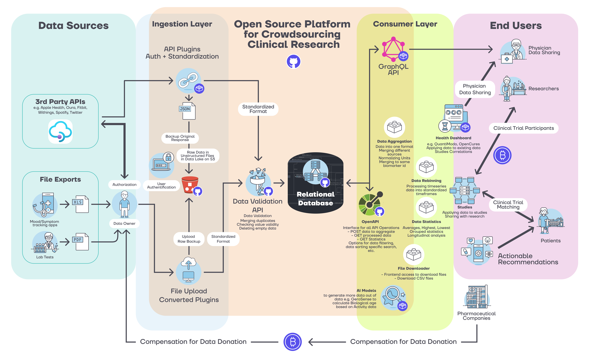
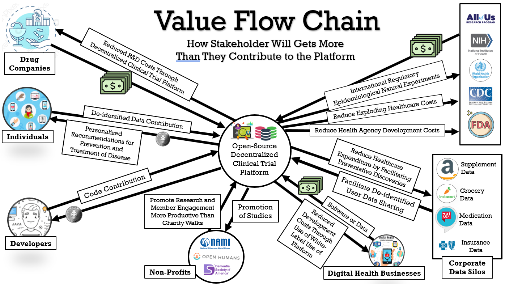

# 💡 Litepaper

## tl;dr

CureDAO is a decentralized alliance of individuals, government, businesses, and nonprofits devoted to the minimization of suffering.

To achieve this, we propose the creation of an open-source framework that overcomes the traditional economic barriers to cooperation and data-sharing in the field of digital health.

It consists of two primary components:

1. An Open-Source Platform for Health Data:
   1. Storage
   2. Security
   3. Access Control
   4. De-identified Data Sharing
2. An Open Plugin Ecosystem enabling anyone to create or use plugins that facilitate:
   1. Import from any application, wearable device, or other data source
   2. New Clinical Discoveries through Machine Learning
   3. Personalized Real-Time Decision Support Informing Individuals of the Most Effective things they can do to treat and prevent disease
   4. Data format transformation to enable interoperability with any system or application
   5. Patient Management
   6. Decentralized Clinical Trial Management
   7. Precision Medicine
   8. Large-scale, low-cost research to discover new ways to prevent and treat chronic diseases

It will overcome the traditional barriers to collaboration and data sharing by encoding all data and intellectual property contributions to the platform in a non-fungible token (NFT). Using smart contracts, the platform will be able to compensate all contributors with royalties for their contributions.

## Join Us Right Now!

Hey, you! 👀

CureDAO is open to anyone interested in preventing suffering and death from chronic diseases and degenerative diseases. Our success in this mission will be an exponential function of the participation of people like you. 🚀

Creating a new software ecosystem for health data not only requires developers but anyone with skills in:

* user interface and user experience design
* project management
* communications and marketing
* web3 technologies
* business development
* life sciences
* medicine
* data science

Our main philosophy is: It's not what you CAN do but what do you WANT to do is what counts.

#### 👉 [How To Get Involved](how-to/)

## Whitepaper

1. [Introduction and Challenges](constitution/1-introduction-and-challenges.md)
2. [Solution](constitution/2-solution.md)
3. [Platform](constitution/3-platform.md)
4. [Incentivization](constitution/4-incentivization.md)
5. [Organization](constitution/5-organization.md)
6. [Tokenomics](constitution/6-tokenomics.md)
7. [Revenue](constitution/7-revenue.md)
8. [Legal Framework](constitution/8-legal-framework.md)
9. [Privacy](constitution/9-privacy.md)
10. [Ecosystem](constitution/10-ecosystem.md)
11. [Roadmap](constitution/11-roadmap.md)
12. [References](constitution/12-references.md)

This work is licensed under a [Creative Commons Attribution-NonCommercial-ShareAlike 4.0 International License](http://creativecommons.org/licenses/by-nc-sa/4.0/).
