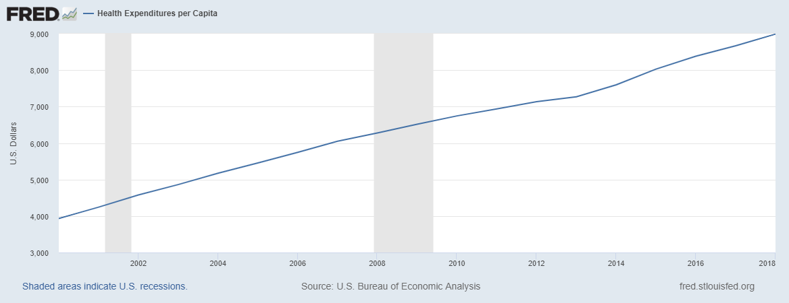
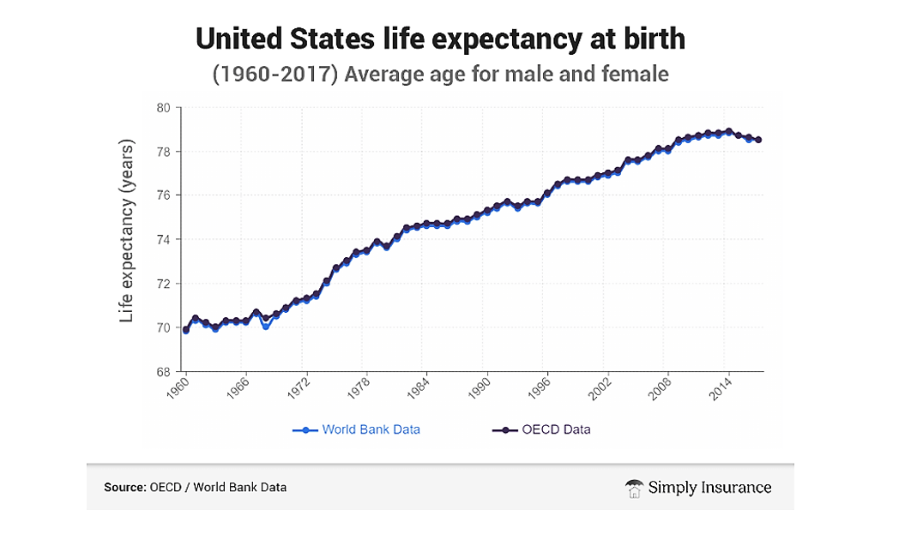

# What is this?
This is the constitution for a decentralized autonomous organization (DAO) whose mission is to alleviate suffering.

# Why Should I Join?
[150,000](https://www.weforum.org/agenda/2020/05/how-many-people-die-each-day-covid-19-coronavirus/) people die every day. This is equivalent to a September 11th terrorist attack occurring every [28](https://en.wikipedia.org/wiki/Casualties_of_the_September_11_attacks#:~:text=During%20the%20September%2011%202001,and%2044%20were%20in%20Pennsylvania.) minutes.

Additionally, there are over [2 billion](https://www.george-health.com/global-health-challenge/) people suffering from chronic diseases.

Healthcare spending has been [increasing](https://fred.stlouisfed.org/series/HLTHSCPCHCSA) to address this problem.

Additionally, there has been an explosion of recent technological advances in digital health. These include:

* genetic sequencing
* gut microbiome sequencing
* [350,000](https://www2.deloitte.com/us/en/blog/health-care-blog/2021/how-digital-health-apps-are-empowering-patients.html#:~:text=Globally%2C%20more%20than%20350%2C000%20health,from%20the%20various%20app%20stores.) digital health apps
* a [billion](https://www.statista.com/statistics/487291/global-connected-wearable-devices/) connected wearable devices

These innovations have produced [50-fold](https://www.weforum.org/agenda/2015/10/who-should-own-our-health-data/) growth in the amount of data on every factor that could improve or exacerbate disease.

Despite all of this, since 2014, life expectancy has actually been [declining](https://).

# Why haven't we seen a reduction in disease burden?

# What's the Solution?

So, this explosion in technology, data, and spending has produced no measurable improvement 
in human health.  The reason, in a single word, is **incentives**.

The current economic system punishes every stakeholder in the ecosystem for doing the things that would lead to 
progress. 

# How does it work?

Anonymous DAO is a decentralized alliance of individuals and government, businesses, and nonprofits devoted to the minimization of suffering.  To achieve this, we propose the creation of an open-source decentralized health platform that will produce a massive acceleration of large scale research to discover new ways to prevent and treat chronic diseases.

