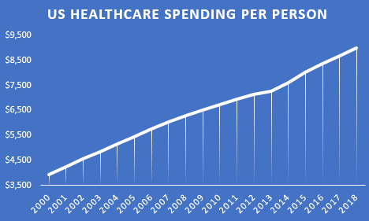
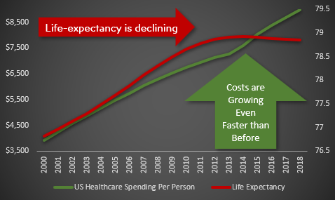
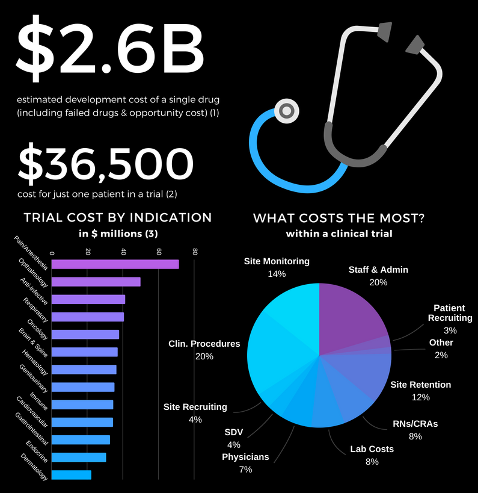
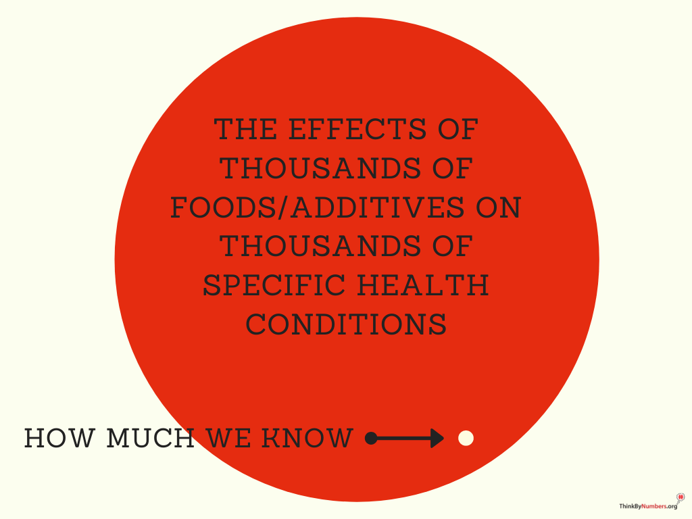
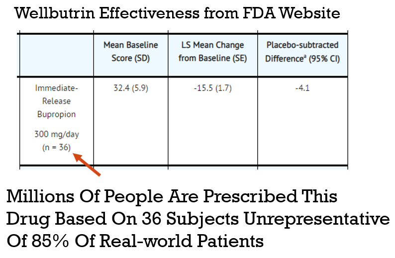

# ☠ Introduction and Challenges

#### 👈 [Back to Table of Contents](../)

## 1. The Problem: You and Everyone You Love Will Suffer and Die

There are over [2 billion](https://www.george-health.com/global-health-challenge/) people suffering from chronic diseases.

Additionally, [150,000](https://www.weforum.org/agenda/2020/05/how-many-people-die-each-day-covid-19-coronavirus/) people die every single day by possibly preventable degenerative diseases. For perspective, this is equivalent to:

* [**FIFTY-ONE**](https://en.wikipedia.org/wiki/Casualties\_of\_the\_September\_11\_attacks) September 11th attacks every day
* [**NINE**](https://en.wikipedia.org/wiki/Casualties\_of\_the\_September\_11\_attacks) Holocausts every year

### 1.1 The status quo in numbers

**Will throwing more money at the existing healthcare system save us?**

Since 2014, healthcare spending per person has been [increasing faster than ever before](https://fred.stlouisfed.org/series/HLTHSCPCHCSA).

Despite this additional spending, life expectancy has actually been \[declining]\(.. /assets/life-expectancy/life-expectancy-chart.png) since 2014.

**Will digital health innovation save us?**

There has been an explosion of recent technological advances in digital health including:

* genetic sequencing
* gut microbiome sequencing
* [350,000](https://www2.deloitte.com/us/en/blog/health-care-blog/2021/how-digital-health-apps-are-empowering-patients.html) digital health apps
* a [billion](https://www.statista.com/statistics/487291/global-connected-wearable-devices/) connected wearable devices

These innovations have produced [50-fold](https://www.weforum.org/agenda/2015/10/who-should-own-our-health-data/) growth in the amount of data on every disease and every factor that could improve, exacerbate, or prevent it. ([chart](../assets/data/growth-in-health-data-chart.png))

This data exists in the form of:

* Electronic Medical Records
* Genetic Sequencing
* Data from Fitness and Sleep trackers
* Data from diet and treatment tracking apps
* Health insurance claims
* Grocery, pharmacy, and nutritional supplement receipts and purchases
* Clinical trial results

The digital health revolution started over a decade ago. It was promised to improve human health and reduce costs. Yet, all we've seen is increasing costs, increasing disease burden, and decreasing life expectancy.

**Why haven't we seen a reduction in disease burden?**

So, this explosion in technology, data, and spending has produced no measurable improvement in human health. The reason, in a single word, is **incentives**. The current economic system punishes every stakeholder in the ecosystem for doing the things that would lead to progress.

### 1.2 Problems in Clinical Research

#### 1.2.1 The Cost of Clinical Research

* It costs [$2.6 billion](https://www.semanticscholar.org/paper/Innovation-in-the-pharmaceutical-industry%3A-New-of-DiMasi-Grabowski/3275f31c072ac11c6ca7a5260bd535720f07df41) to bring a drug to market (including failed attempts).
* The process takes over 10 years.
* It costs [$36k](https://www.clinicalleader.com/doc/getting-a-handle-on-clinical-trial-costs-0001) per subject in Phase III clinical trials.

 [source: clinicalresearch.io](https://www.clinicalresearch.io/blog/industry-trends/cost-of-clinical-trials-breakdown/)

This high cost leads to the following problems:

**No Data on Unpatentable Molecules**

We still know next to nothing about the long-term effects of 99.9% of the 4 pounds of over [7,000](https://www.dailymail.co.uk/health/article-8757191/Are-additives-food-making-ill.html) different synthetic or natural chemicals you consume every day.

Under the current system of research, it costs [$41k](https://www.clinicalleader.com/doc/getting-a-handle-on-clinical-trial-costs-0001#:\~:text=The%20clinical%20trials%20cost%20a,and%20benchmarking%20clinical%20trial%20costs.) per subject in Phase III clinical trials. As a result, there is not a sufficient profit incentive for anyone to research the effects of any factor besides a molecule that can be patented.

**Lack of Incentive to Discover the Full Range of Applications for Off-Patent Treatments**

There are roughly [10,000](https://www.washingtonpost.com/news/fact-checker/wp/2016/11/17/are-there-really-10000-diseases-and-500-cures/) known diseases afflicting humans, most of which (approximately 95%) are classified as “orphan” (rare) diseases. The current system requires that a pharmaceutical company predict a particular condition in advance of running clinical trials. If a drug is found to be effective for other diseases after the patent has expired, no one has the financial incentive to get it approved for another disease.

**No Long-Term Outcome Data**

Even if there is a financial incentive to research a new drug, there is no data on the long-term outcomes of the drug. The data collection period for participants can be as short as several months. Under the current system, it's not financially feasible to collect data on a participant for years or decades. So we have no idea if the long-term effects of a drug are worse than the initial benefits.

For instance, even after controlling for co-morbidities, the Journal of American Medicine recently found that long-term use of Benadryl and other anticholinergic medications is associated with an [increased](https://jamanetwork.com/journals/jamainternalmedicine/fullarticle/2091745) risk for dementia and Alzheimer disease.

#### 1.2.2 Conflicts of Interest

Long-term randomized trials are extremely expensive to set up and run. When billions of dollars in losses or gains are riding on the results of a study, this will almost inevitably influence the results. For example, an analysis of beverage studies, [published in the journal PLOS Medicine,](https://web.archive.org/web/20211207021133/https://journals.plos.org/plosmedicine/article?id=10.1371/journal.pmed.1001578#s3) found that those funded by Coca-Cola, PepsiCo, the American Beverage Association, and the sugar industry were **five times** more likely to find no link between sugary drinks and weight gain than studies whose authors reported no financial conflicts.

The economic survival of the pharmaceutical company is dependent on the positive outcome of the trial. While there's not a lot of evidence to support that there's any illegal manipulation of results, it leads to two problems:

**Negative Results are Never Published**

Pharmaceutical companies that sponsor research often report only “positive” results, leaving out the non-findings or negative findings where a new drug or procedure may have proved more harmful than helpful. Selective publishing can prevent the rapid spread of beneficial treatments or interventions, but more commonly it means that bad news and failure of medical interventions go unpublished. Past analysis of clinical trials supporting new drugs approved by the FDA showed that just [43 percent of more than 900 trials on 90 new drugs](https://www.livescience.com/8365-dark-side-medical-research-widespread-bias-omissions.html) ended up being published. In other words, about 60 percent of the related studies remained unpublished even five years after the FDA had approved the drugs for market. That meant physicians were prescribing the drugs and patients were taking them without full knowledge of how well the treatments worked.

This leads to a massive waste of money by other companies repeating the same research and going down the same dead-end streets that could have been avoided.

#### 1.2.3 Questionable Representation of Real Patients through Trials

External validity is the extent to which the results can be generalized to a population of interest. The population of interest is usually defined as the people the intervention is intended to help.

Phase III clinical trials are designed to exclude a vast majority of the population of interest. In other words, the subjects of the drug trials are not representative of the prescribed recipients, once said drugs are approved. One investigation found that only [14.5%](https://www.ncbi.nlm.nih.gov/pubmed/14628985) of patients with major depressive disorder fulfilled eligibility requirements for enrollment in an antidepressant efficacy trial.

As a result, the results of these trials are not necessarily generalizable to patients matching any of these criteria:

* Suffer from multiple mental health conditions (e.g. post-traumatic stress disorder, generalized anxiety disorder, bipolar disorder, etc.)
* Engage in drug or alcohol abuse
* Suffer from mild depression (Hamilton Rating Scale for Depression (HAM-D) score below the specified minimum)
* Use other psychotropic medications

These facts call into question the external validity of standard efficacy trials.

Furthermore, patient sample sizes are very small. The number of subjects per trial on average:

* [275](https://www.ncbi.nlm.nih.gov/books/NBK50886/) patients are sought per cardiovascular trial
* [20](https://www.ncbi.nlm.nih.gov/books/NBK50886/) patients per cancer trial
* [70](https://www.ncbi.nlm.nih.gov/books/NBK50886/) patients per depression trial
* [100](https://www.ncbi.nlm.nih.gov/books/NBK50886/) per diabetes trial

In the example in graphic above a drug is prescribed to millions of patients based on a study with only 36 subjects, where a representation of the general public is questionable.

The Vision of personalized Precision Medicine still opens up a lot of room to grow for our knowledge about the efficacy of drugs. Therefore a patient would like to know which drug or therapy has the most potential success with his specific demographic or phenotypic profile like age, gender, ethnicity, lifestyle and factors like family history and interferences with other conditions and interventions.

### 1.3 Problems in Digital Health Innovation

#### 1.3.1 Resources Wasted on Duplication of Effort

There are more than [350,000](https://www.emarketer.com/content/over-350k-digital-health-apps-flooding-market-here-s-how-apps-stand) health apps. Mobile health app development costs [$425,000](https://www.mobihealthnews.com/content/mobile-health-app-development-costs-425000-average-likely-continuing-rise) on average. Most of these have a big overlap in functionality representing [$157,500,000,000](https://www.mobihealthnews.com/content/mobile-health-app-development-costs-425000-average-likely-continuing-rise) wasted on duplication of effort.

Therefore the rate of progress could in theory be increased by a estimated 350,000 times with shared source code of the overlapping functionalities.

!\[closed source competition vs open source collaboration]\(.. /assets/open-source/closed-source-competition-vs-open-source-collaboration.sketch.png)

The obstacle has been the free-rider problem. Businesses that open source their code give their closed-source competitors an unfair advantage. This increases their likelihood of bankruptcy even higher than the 90% failure rate they already faced.

Currently governments around the world are spending billions in funding closed-source propriety health software. The Public Money Public Code initiative would require governments to recognize software as a [public good](https://en.wikipedia.org/wiki/Public\_good\_\(economics\)) and require that publicly-funded software be open source.

#### 1.3.2 Isolated Data Silos

The best that isolated data on individual aspects of human health can do is tell us about the past. For example, dashboards telling us how many steps we made or how much sleep we got are known as “descriptive statistics”. However, by integrating all available data from individuals, similar populations, as well as existing clinical research findings and applying machine learning we may achieve “prescriptive” statistics for advanced insight generation. From that point functionalities like real-time decision support for improving health or biological age clocks and health risks can be leveraged.

### 1.4 Problems with knowledge about the underlying root of degenerative diseases (aging)

If we would have reliable biomarkers for aging already, research could find interventions for the root cause of degenerative diseases which is aging itself. Despite many years of research, we still don’t have reliable biomarkers for aging. One of the main problems is the distance between genotype and phenotype. It is proposed that by studying the relationships between proteins and metabolites, essentially a multi-omic process, would allow the creation of “endophenotypes” to help identify a signature (Hoffman et al. 2017).

#### Problems with current biomarkers for aging:

Hundreds of genes found to affect aging in model organisms do not have significant association with longevity in humans. Humans are genetically diverse in comparison to model organisms and this contributes to the weak signature of any set of genes towards longevity. Environmental effects on aging are relatively unknown.

#### Problems with current approaches:

A genome-wide association study (GWAS) is an approach used in genetics research to associate specific genetic variations with particular diseases. GWAS can only explain a small fraction of the heritability of many human traits, including aging. Transcriptomics can help, but it can’t explain the whole story. Proteomics is actually the enzyme workhorse of biology and the insight into protein levels is especially important. Metabolomics are the building blocks that proteins work with and is necessary for a better insight into the state of the running system.

Rather than focusing on individual proteins and metabolites, a multi-omics approach can focus on pathway activation and how those pathways are maintained by individual entities and their relationships with each other. We want to identify the difference between young and old network states and be able to tell when an intervention is moving a system towards a more healthy state.

#### [Next Solution](2-solution.md) 👉

This work is licensed under a [Creative Commons Attribution-NonCommercial-ShareAlike 4.0 International License](http://creativecommons.org/licenses/by-nc-sa/4.0/).
