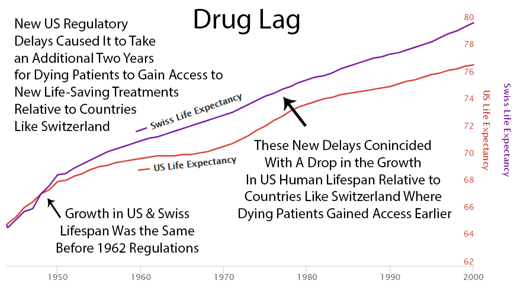
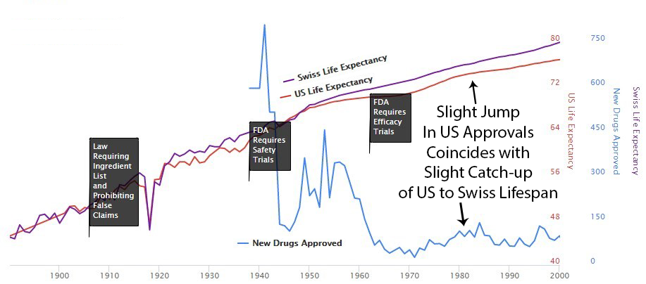
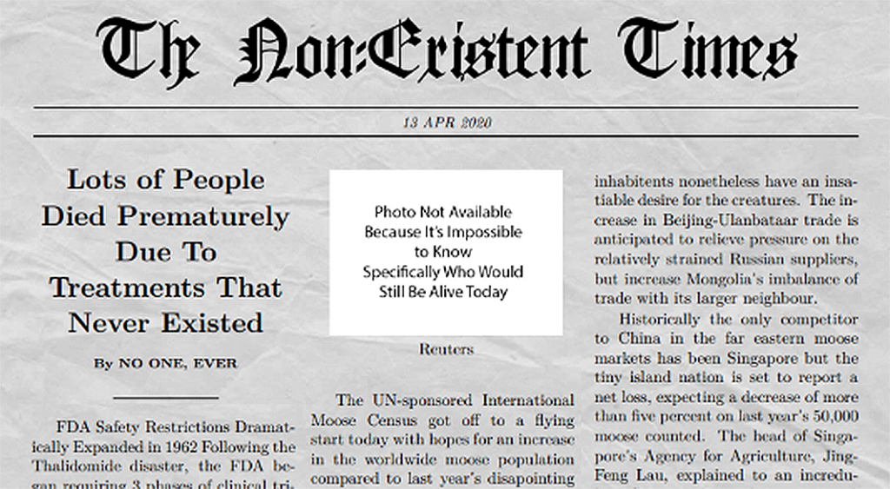

# 💡 Solution

👈 [Back to Table of Contents](../README.md)

The solution to the lack of progress and increasing healthcare expense is to use the oceans of real-world evidence to discover new cures.

### 2.1 The Personalized, Preventive, Precision Medicine of the Future

Out of an existing pool of big health data, an insilico model of human biology can be developed to discover new interventions and their personalized dosages and combinations.

One way to achieve this is to view the human body as a black box with inputs and outputs.
We can apply [predictive machine learning models](../plugins/optomitron-real-time-decision-support-plugin/optomitron-real-time-notifications-plugin.md) to [stratified groups](https://en.wikipedia.org/wiki/Stratified\_sampling)
of similar people based on their data of their following profiles:

* [Genomic](https://en.wikipedia.org/wiki/Genomics)
* [Transcriptomic](https://en.wikipedia.org/wiki/Transcriptome)
* [Proteomic](https://en.wikipedia.org/wiki/Proteomics)
* [Metabolomic](https://en.wikipedia.org/wiki/Metabolomics)
* [Microbiomic](https://en.wikipedia.org/wiki/Microbiota)
* [Phenotype](https://en.wikipedia.org/wiki/Phenotype)
* [Diseasomic](http://ijream.org/papers/IJREAMV05I0250057.pdf)
* [Pharmacomicrobiomic](https://en.wikipedia.org/wiki/Pharmacomicrobiomics)
* [Pharmacogenomic](https://en.wikipedia.org/wiki/Pharmacogenomics)
* [Foodomic](https://en.wikipedia.org/wiki/Foodomics)
* [Exposome](https://en.wikipedia.org/wiki/Environmental\_factor#Exposome)

This will enable the discovery of the full personalized range of positive and negative relationships for all factors without a profit incentive for traditional trials.

### 2.2 The Potential of Real-World Evidence-Based Studies

* **Diagnostics** - Data mining and analysis to identify causes of illness
* **Preventative medicine** - Predictive analytics and data analysis of genetic, lifestyle, and social circumstances to prevent disease
* **Precision medicine** - Leveraging aggregate data to drive hyper-personalized care
* **Medical research** - Data-driven medical and pharmacological research to cure disease and discover new treatments and medicines
* **Reduction of adverse medication events** - Harnessing of big data to spot medication errors and flag potential adverse reactions
* **Cost reduction** - Identification of value that drives better patient outcomes for long-term savings
* **Population health** - Monitor big data to identify disease trends and health strategies based on demographics, geography, and socioeconomic

#### Cost Savings in Drug Development

Failed drug applications are expensive. A global database of treatments and outcomes could provide information that could avoid massive waste on failed trials.

- A 10% improvement in predicting failure before clinical trials could save [$100 million](https://drugwonks.com/blog/the-dog-days-of-drug-approvals) in development costs.
- Shifting 5% of clinical failures from Phase III to Phase I reduces out-of-pocket costs by [$15 to $20 million](https://drugwonks.com/blog/the-dog-days-of-drug-approvals).
- Shifting failures from Phase II to Phase I would reduce out-of-pocket costs by [$12 to $21 million](https://drugwonks.com/blog/the-dog-days-of-drug-approvals).

#### Cost Savings Through Decentralization

- In phase II studies, the typical decentralized clinical trial (DCT) deployment produced a [400%](../assets/financial-benefits-of-decentralized-trials.pdf) return on
  investment
  in terms of trial cost reductions.
- In phase III studies, decentralization produced a [1300%](../assets/financial-benefits-of-decentralized-trials.pdf) return on investment.

### Problems with Historical Observational Research

When people think of observational research, they typically think of correlational association studies.

**Why It Seems Like Diet Advice Flip-Flops All the Time**

In 1977, the USDA and Time Magazine warned Americans against the perils of dietary cholesterol.
Yet, in 1999, TIME released a very different cover, suggesting that dietary cholesterol is fine.

#### Correlational is Not The Same as Causation

There are two primary ways of undertaking studies to find out what affects our health:

1. observational studies - the easier of the two options. They only require handing out questionnaires to people about their diet and lifestyle habits, and then again a few years later to find out which patterns are associated with different health outcomes.
2. randomized trials - the far more expensive option. Two groups of randomly selected people are each assigned a different intervention.

The most significant benefit of randomized trials is the "control group".
The control group consists of the people who don't receive the intervention or medication in a randomly-controlled trial.
It helps to overcome the confounding variable problem that plagues observational studies.

A common source of confounding variables in correlational association studies is the "healthy person bias". For instance, say an observational study finds "People Who Brush Teeth Less Frequently Are at Higher Risk for Heart Disease". It may just be a coincidence caused by a third confounding variable. People that brush their teeth more are more likely to be generally concerned about their health. So, the third confounding factor could be that people without heart disease could also exercise more or eat better.

However, the massive amount of automatically collected, high-frequency longitudinal data we have today makes it possible to overcome the flaws with traditional observational research.

#### Overcoming the "No Control Group" Problem

The primary flaw with observational research is that they lack the control group.
However, a single person can act as their own control group with high-frequency longitudinal data.
This is done by using an A/B experiment design.

For instance, if one is suffering from arthritis and they want to know if a Turmeric Curcumin supplement helps, the experimental sequence would look like this:

1. Month 1: Baseline (Control Group) - No Curcumin
2. Month 2: Treatment (Experimental Group) - 2000mg Curcumin/day
3. Month 3: Baseline (Control Group) - No Curcumin
4. Month 4: Treatment (Experimental Group) - 2000mg Curcumin/day

The more this is done, the stronger the statistical significance of the observed change from the baseline.
However, there are also effects from other variables.
These can be addressed using a diffusion-regression state-space model that predicts the counter-factual response.
This involves the creation of a synthetic control group.
This artificial control illustrates what would have occurred had no intervention taken place.
In contrast to classical difference-in-differences schemes, state-space models make it possible to:

1. infer the temporal evolution of attributable impact
2. incorporate empirical priors on the parameters in a fully Bayesian treatment
3. flexibly accommodate multiple sources of variation, including:
   1. local trends
   2. seasonality
   3. the time-varying influence of contemporaneous covariates

At this time, we apply coefficients representative of each of [Hill’s criteria for causation](http://www.drabruzzi.com/hills\_criteria\_of\_causation.htm) to quantify the likelihood of a causal relationship between two measures as:

* _**Strength Coefficient**_: A relationship is more likely to be causal if the correlation coefficient is large and statistically significant. This is determined through the use of a two-tailed t-test for significance.
* _**Consistency Coefficient**_: A relationship is more likely to be causal if it can be replicated. This value is related to the variation of the average change from baseline for other participants with the same treatment outcome variables in conjunction with the variation in average change from multiple experiments in the same individual.
* _**Specificity Coefficient**_: A relationship is more likely to be causal if there is no other plausible explanation. Relationships are calculated based on different potential predictor variables available for the individual over the same period. The value of the Specificity Coefficient starting at one is decreased by the strength of the most robust relationship of all other factors.
* _**Temporality Coefficient**_: A relationship is more likely to be causal if the effect always occurs after the cause.
* _**Gradient Coefficient**_: The relationship is more likely to be causal if more significant exposure to the suspected cause leads to a greater effect. This is represented by the k-means squared difference between the normalized pharmacokinetic time-lagged treatment outcome curves.
* _**Plausibility Coefficient**_: A relationship is more likely to be causal if a plausible mechanism exists between the cause and the effect. This is derived from the sum of the crowd-sourced plausibility votes on the study.
* _**Coherence**_: A relationship is more likely to be causal if compatible with related facts and theories. This is also derived from the sum of the crowd-sourced plausibility votes on the study.
* _**Experiment Coefficient**_: A relationship is more likely to be causal if it can be verified experimentally. This coefficient is proportional to the number of times an A/B experiment is run.
* _**Analogy**_: A relationship is more likely to be causal if there are proven relationships between similar causes and effects. This coefficient is proportional to the consistency of the result for a particular individual with the number of other individuals who also observed a similar effect.

#### Meta-Analyses Support of Real-World Evidence

Observational real-world evidence-based studies have several advantages over randomized, controlled trials, including lower cost, increased speed of research, and a broader range of patients. However, concern about inherent bias in these studies has limited their use in comparing treatments. Observational studies have been primarily used when randomized, controlled trials would be impossible or unethical.

However, [meta-analyses](https://www.nejm.org/doi/full/10.1056/NEJM200006223422506) found that:

> when applying modern statistical methodologies to observational studies, the results are generally **not quantitatively or qualitatively different** from those obtained in randomized, controlled trials.

#### Mortality Observational Studies

#### Observational Studies for Various Outcomes

### Historical Evidence in Support of Real-World Evidence

There is compelling historical evidence suggesting that large scale efficacy-trials based on real-world evidence have ultimately led to better health outcomes than current pharmaceutical industry-driven randomized controlled trials.

For over 99% of recorded human history, the average human life expectancy has been around 30 years.

#### 1893 - The Advent of Safety and Efficiency Trials

In the late nineteenth and early twentieth century, clinical objectivity grew.
The independent peer-reviewed Journal of the American Medical Association (JAMA) was founded in 1893.
It would gather case reports from the 144,000 physicians members of the AMA on the safety and effectiveness of drugs.
The leading experts in the area of a specific medicine would review all of the data and compile them into a study listing side effects and the conditions for which a drug was or was not effective.
If a medicine was found to be safe, JAMA would give its seal of approval for the conditions where it was found to be effective.

The adoption of this system of crowd-sourced, observational, objective, and peer-reviewed clinical research was followed by a sudden shift in the growth of human life expectancy.
After over 10,000 years of almost no improvement, we suddenly saw a strangely linear 4-year increase in life expectancy every single year.

#### 1938 - The FDA Requires Phase 1 Safety Trials

**Elixir sulfanilamide** was an improperly prepared [sulfonamide antibiotic](https://en.wikipedia.org/wiki/Sulfonamide_(medicine)) that caused deaths in the United States in 1937.

Congress [reacted](https://en.wikipedia.org/wiki/Elixir_sulfanilamide) to the tragedy by requiring all new drugs to include
"adequate tests by all methods reasonably applicable to show whether or not such drug is safe for use under the conditions prescribed, recommended, or suggested in the proposed labeling thereof."

These requirements evolved to what is now called the [Phase 1 Safety Trial](https://en.wikipedia.org/wiki/Phase_1_safety_trial).

This consistent 4 year/year increase in life expectancy remained unchanged before and after the new safety regulations.

This suggests that the regulations did not have a large-scale positive or negative impact on the development of life-saving interventions.

#### 1950's - Thalidomide Causes Thousands of Birth Defects Outside US

Thalidomide was first marketed in Europe in [1957](https://en.wikipedia.org/wiki/Thalidomide) for morning sickness.
While it was initially thought to be safe in pregnancy, it resulted in thousands of horrific birth defects.

Fortunately, the existing FDA safety regulations prevented any birth defects in the US.
Despite the effectiveness of the existing US regulatory framework in protecting Americans, newspaper stories such as the one below created a strong public outcry for increased regulation.

#### 1962 - New Efficacy Regulations Reduce the Amount and Quality of Efficacy Data Collected

As effective **safety** regulations were already in place, the government instead responded to the Thalidomide
disaster by regulating **efficacy** testing via the 1962 Kefauver Harris Amendment.
Before the 1962 regulations, it cost a drug manufacturer an average of $74 million (2020 inflation-adjusted) to
develop and test a new drug for safety before bringing it to market. Once the FDA had approved it as safe, efficacy testing was performed by the third-party American Medical Association.
Following the regulation, trials were instead to be conducted in small, highly-controlled trials by the pharmaceutical
industry.

##### Reduction in Efficacy Data

The 1962 regulations made these large real-world efficacy trials illegal.
Ironically, even though the new regulations were primarily focused on ensuring that drugs were effective through controlled FDA efficacy trials, they massively reduced the quantity and quality of the efficacy data that was collected for several reasons:

* New Trials Were Much Smaller
* Participants Were Less Representative of Actual Patients
* They Were Run by Drug Companies with Conflicts of Interest Instead of the 3rd Party AMA

##### Reduction in New Treatments

The new regulatory clampdown on approvals immediately reduced the production of new treatments by 70%.

##### Explosion in Costs

Since the abandonment of the former efficacy trial model, costs have exploded.
Since 1962, the cost of bringing a new treatment to market has gone from [$74 million](https://publications.parliament.uk/pa/cm200405/cmselect/cmhealth/42/4207.htm) to over
[$1 billion](https://publications.parliament.uk/pa/cm200405/cmselect/cmhealth/42/4207.htm) US dollars (2020 inflation-adjusted).

###### High Cost of Development Favors Monopoly and Punishes Innovation

There's another problem with the increasing costs of treatment development.
In the past, a genius scientist could come up with a treatment, raise a few million dollars, and do safety testing.
Now that it costs a billion dollars to get a drug to market, the scientist has to persuade one of a few giant drug companies that can afford it to buy his patent.

Then the drug company has 2 options:

**Option 1: Risk $1 billion on clinical trials**

**Possibility A:** Drug turns out to be one of the 90% the FDA rejects.
GIVE BANKER A BILLION DOLLARS. DO NOT PASS GO.

**Possibility B:** Drug turns out to be one of the 10%, the FDA approves.
Now it's time to try to recover that billion dollars.
However, there are very few drug companies with enough money to survive this game.
So, this company almost certainly already has an existing inferior drug on the market to treat the same condition.
Hence, any profit they make from this drug will likely be subtracting from revenue from other drugs they've already spent a billion dollars on.

**Option 2: Put the patent on the shelf**

Do not take a 90% chance of wasting a billion dollars on failed trials.
Do not risk making your already approved cash-cow drugs obsolete.

What's the benefit of bringing better treatment to market if you're just going to lose a billion dollars?
Either way, the profit incentive is entirely in favor of just buying better treatments and shelving them.

###### Cures Are Far Less Profitable Than Lifetime Treatments

Imagine you had to pay a lifetime of power bills all at once And that's just if the new drug is a lifelong treatment.
If the new treatment is a permanent cure for the disease, replacing a lifetime of refills with a one-time purchase would be economically disastrous.

How is there any financial incentive for medical progress at all?

Fortunately, we don't have a complete monopoly on treatment development.
However, the more expensive it is, the fewer participants can afford to be in that business.
So it inevitably becomes more monopolistic and there arise more of these situations where the cost of trials exceeds the profits from selling the drug.

###### People With Rare Disease are Particularly Harmed

In the case of rare diseases, increasing the cost of treatment development to over a billion makes it impossible to recover your investment from a small number of patients.
So rare disease patients are suffering the greatest harm from the added regulatory burden on development.

How high should the cost of drug development be on our list of human problems?
Well, when something costs more, you get less of it.
For people who are dying of cancer, the fact that we couldn't afford enough research to cure them is definitely at the top of their list of human problems.

##### Delayed Life-Saving Treatments

One unanticipated consequence of the amendments was that the new burden of proof made the process of drug development both more expensive and much longer, leading to increasing drug prices and a “drug lag”.
After that point, whenever they released some new cancer or heart medication that was going to save 50 thousand lives a year, it meant that over the previous 10 years of trials 500 people died because they didn't have access to the drug earlier.

###### Deaths Due to US Regulatory "Drug Lag"

A comparative analysis between countries suggest that delays in new interventions cost anywhere from [21,000 to 120,
000](https://www.fdareview.org/features/references/#gieringer85) US lives per decade.

Deaths owing to drug lag have been numbered in the [hundreds of thousands](https://www.fdareview.org/features/references/#wardell78a).
It's estimated that practolol, a drug in the beta-blocking family, could save ten thousand lives a year is allowed in the United States. Although the FDA allowed a first beta-blocker, propranolol, in 1968, three years after that drug had been available in Europe, it waited until 1978 to allow the use of propranolol for the treatment of hypertension and angina pectoris, its most important indications.
Despite clinical evidence as early as 1974, only in 1981 did the FDA allow a second beta-blocker, timolol, for the prevention of a second heart attack. The agency’s withholding of beta-blockers was alone responsible for probably [tens of thousands of deaths](https://www.fdareview.org/features/references/#gieringer85).

[Data](http://csdd.tufts.edu/databases) from the Tufts Center for the Study of Drug Development suggests that thousands of patients have died because
of US regulatory delays relative to other countries, for new drugs and devices, including:

- interleukin-2
- taxotere
- vasoseal
- ancrod
- glucophage
- navelbine
- lamictal
- ethyol
- photofrin
- rilutek
- citicoline
- panorex
- femara
- prostar
- omnicath

Prior to US FDA approval most of these drugs and devices had already been available in other countries for a year or longer.

Following the 1962 increase in US regulations, one can see a divergence from the growth in life expectancy in Switzerland which did not introduce the same delays to availability.

Perhaps it's a coincidence, but you can see an increase in drug approvals in the '80s and at the same time the gap between Switzerland and the US gets smaller then.
Then US approvals go back down in the '90s and the gap expands again.

##### Increase in Patent Monopoly

Industry agitation surrounding the “drug lag” finally led to the modification of the drug patenting system in the Drug Price Competition and Patent Term Restoration Act of 1984. This further extended the life of drug patents. Thus Kefauver's amendments ultimately affected both pharmaceutical pricing and patenting — in a manner diametrically opposed to the one he intended.

##### Decreased Ability to Determine Comparative Efficacy

The placebo-controlled, randomized controlled trial helped researchers gauge the efficacy of an individual drug. However, it makes determination of comparative efficacy much more difficult.

##### Slowed Growth in Life Expectancy

Prior to 1962, rapid advancements in medical science had been producing a 4-year increase in human lifespan every year.
This amazingly linear growth rate had followed millennia with a flat human lifespan of around 28 years.
Following this new 70% reduction in the pace of medical progress, the growth in human lifespan was immediately cut in half to an increase of 2 years per year.

###### Diminishing Returns?

You might say “It seems more likely — or as likely — to me that drug development provides diminishing returns to
life expectancy.”
However, diminishing returns produce a slope of exponential decay.
It may be partially responsible, but it’s not going to produce a sudden change in the linear slope of a curve a linear as life expectancy was before and after the 1962 regulations.

###### Correlation is Not Causation

You might say "I don't know how much the efficacy regulations contribute to or hampers public health. I do know that
correlation does not necessarily imply causation."
However, a correlation plus a logical mechanism of action is the least bad method we have for inferring the most likely significant causal factor for an outcome (i.e. life expectancy). Assuming most likely causality based on temporal correlation is the entire basis of a clinical research study and the scientific method generally.

###### Impact of Innovative Medicines on Life Expectancy

A [three-way fixed-effects analysis](https://pubmed.ncbi.nlm.nih.gov/30912800) of 66 diseases in 27 countries, suggests that if no new drugs had been launched after 1981, the number of years of life lost would have been 2.16 times higher it actually was.
It estimates that pharmaceutical expenditure per
life-year saved was [$2837](https://pubmed.ncbi.nlm.nih.gov/30912800).

More people survive as more treatments are developed. There's a [strong correlation](http://valueofinnovation.org/power-of-innovation) between the development of new
cancer treatments and cancer survival over 30 years.

### FDA Mandate is Not to Maximize Lives Saved

Increasing lifespan is not the congressional mandate of the FDA.
Its mandate is to ensure the "safety and efficacy of drugs and medical devices".
It has been very successful at fulfilling its mandate.

But lots of people with AIDS and cancer will die while waiting for treatment.

### Cognitive Bias Against Acts of Commission

Humans have a cognitive bias towards weighting harmful acts of commission to be worse than acts of omission even if the act of omission causes greater harm.
It's seen in the trolley problem where people generally aren't willing to push a fat man in front of a train to save a family even though more lives would be saved.

Medical researcher Dr. Henry I. Miller, MS, MD described his experience working at the FDA, 
“In the early 1980s,” Miller wrote, “when I headed the team at the FDA that was reviewing the NDA [application] for recombinant human insulin…my supervisor refused to sign off on the approval,” 
despite ample evidence of the drug’s ability to safely and effectively treat patients. 
His supervisor rationally concluded that, if there was a death or complication due to the medication, heads would roll at the FDA—including his own.  
So the personal risk of approving a drug is magnitudes larger than the risk of rejecting it.

### It's Impossible to Report on Deaths That Occurred Due to Unavailable Treatments

Here's a news story from the Non-Existent Times by No One Ever without a picture of all the people that die from lack of access to life-saving treatments that might have been.

This means that it's only logical to regulators to reject drug applications by default. 
The personal risks of approving a drug with any newsworthy side effect far outweigh the personal risk preventing access to a life-saving treatment.

## Current Regulation Expects Drug Developers to Have Psychic Powers

When running an efficacy trial, the FDA expects that the drug developer has the psychic ability to predict which 
conditions a treatment will be most effective for in advance of collecting the human trial data.  
If it was possible to magically determine this without any trials, it would render efficacy trials completely pointless.

In 2007, manufacturer Dendreon submitted powerful evidence attesting to the safety and efficacy of its immunotherapy drug Provenge, which targets prostate cancer. 
They wer able to show that the drug resulted in a significant decline in deaths among its study population, which even 
swayed the FDA advisory committee weighing in on the application. But ultimately, the FDA rejected its application.

The FDA was unmoved by the evidence, simply because Dendreon didn’t properly specify beforehand what its study was trying to measure. 
Efficacy regulations state that finding a decline in deaths is not enough. 
The mountains of paperwork must be filled out just-so, and in the correct order. 
It took three more years and yet another large trial before the FDA finally approved the life-saving medication.

Due to all the additional costs imposed by the efficacy trial burden, Dendreon ultimately filed for chapter 11 bankruptcy.

In addition to the direct costs to companies, the extreme costs and financial risks imposed by efficacy trials have a huge chilling effect on investment in new drugs.  
If you're an investment adviser, trying to avoid losing your clients retirement savings, you're much better off investing in a more stable company like a bomb manufacturer building products to intentionally kill people than a drug developer trying to save lives.
So it's impossible to know all of the treatments that never even got to an efficacy trial stage due to the effects of decreased investment due to the regulatory risks.

## What We Don't Know

We’re only 2 lifetimes from the use of the modern scientific method in medicine.
Thus it's only been applied for 0.0001% of human history.
The more clinical research studies we read, the more we realize we don’t know.
Nearly every study ends with the phrase "more research is needed".
We know basically nothing at this point compared to what will eventually be known about the human body.

There are over [7,000](https://www.washingtonpost.com/news/fact-checker/wp/2016/11/17/are-there-really-10000-diseases-and-500-cures/) known diseases afflicting humans.

There are as many untested compounds with drug-like properties as there are [atoms in the solar system](https://www.nature.com/articles/549445a) (166 billion).

If you multiply the number of molecules with drug-like properties by the number of diseases, that's 1,162,000,000,
000,000 combinations. So far we've studied [21,000 compounds](https://www.centerwatch.com/articles/12702-new-mit-study-puts-clinical-research-success-rate-at-14-percent).

That means we only know 0.000000002% of what is left to be known.

The currently highly restrictive overly cautious method of clinical research prevents us from knowing more faster.

We’re at the very beginning of thousands or millions of years of systematic discovery. So it’s unlikely that this decline in lifespan growth is the result of diminishing returns due to our running out of things to discover.

However, to validate the theory that large-scale real-world evidence can produce better health outcomes requires further validation of this method of experimentation.  That's the purpose of CureDAO.

## Proof of Concept

So far, CureDAO has anonymously aggregated and analyzed data set from over 10 million data points on symptom severity and influencing factors from over 10,000 participants.
This data has been used to publish 90,000 studies on the effects of various treatments and food ingredients on
condition severity in The [Journal of Citizen Science](https://studies.crowdsourcingcures.org).
The accuracy and precision of these studies will continue to improve as more data points are collected and better machine-learning plugins are implemented in the platform.

## References

1. https://go.drugbank.com/stats
2. https://www.ahajournals.org/doi/10.1161/strokeaha.111.621904
3. https://www.fda.gov/media/110437/download
4. https://www.academia.edu/2801726/Is_the_FDA_safe_and_effective
5. https://www.fda.gov/science-research/science-and-research-special-topics/real-world-evidence
6. https://www.cato.org/commentary/end-fda-drug-monopoly-let-patients-choose-their-medicines
7. https://www.fda.gov/files/about%20fda/published/The-Sulfanilamide-Disaster.pdf
8. https://www.fda.gov/regulatory-information/selected-amendments-fdc-act/21st-century-cures-act
9. https://www.fda.gov/media/79922/download
10. https://www.fda.gov/media/120060/download
11. https://www.nature.com/articles/549445a
12. https://www.statista.com/statistics/1041467/life-expectancy-switzerland-all-time/
13. https://www.statista.com/statistics/195950/infant-mortality-rate-in-the-united-states-since-1990/
14. https://kof.ethz.ch/en/news-and-events/kof-bulletin/kof-bulletin/2021/07/Improvements-in-Swiss-life-expectancy-and-length-of-life-inequality-since-the-1870s.html
15. https://docs.google.com/spreadsheets/d/1hltgVd8OO_nfd9m7FUbbsOTXFX4VbDKuFNw4Cy43f7Q/edit#gid=802845894
16. https://www.visualcapitalist.com/which-rare-diseases-are-the-most-common/
17. http://valueofinnovation.org/
18. https://www.medicinesaustralia.com.au/wp-content/uploads/2020/11/Prof-Frank-Lichtenberg_session-3.pdf
19. Anglemyer A., Horvath H.T., and Bero, L. (2014). Healthcare Outcomes Assessed with Observational Study Designs
    Compared with Those Assessed in Randomized Trials (Review), Cochrane Database of Systematic Reviews, Issue
    4, Art No MR000034. doi:10.1002/14651858.MR000034.pub2.
20. Ball, R., Robb, M., Anderson, S.A., and Dal Pan, G. (2016). The FDA’s Sentinel Initiative—A Comprehensive Approach
    to Medical Product Surveillance, Clinical Pharmacology & Therapeutics, 99(3):265-268. doi:10.1002/cpt.320.
    Benson, K. and Hartz, A.J. (2000). A Comparison of Observational Studies and Randomized, Controlled Trials, New
    England Journal of Medicine, 342:1878-1886. doi:10.1056/NEJM200006223422506.
21. Berger, M.J, Sox, H., Willke, R.J., Brixner, D.L., Hans-Georg, E., Goettsch, W., Madigan, D., Makady, A., Schneeweiss,
    S., Tarricone, R., Wang, S.V., Watkins, J., and Mullins, C.D. (2017). Good Practices for Real-World Data Studies of
    Treatment and/or Comparative Effectiveness: Recommendations from the Joint ISPOR-ISPE Special Task Force
    on Real-World Evidence in Health Care Decision Making, Pharmacoepidemiology and Drug Safety, 26(9):1033-
    1039. doi:10.1002/pds.4297.
22. Clinical Trial Transformation Initiative (CTTI) (2017). CTTI Recommendations: Registry Trials. Retrieved from
    https://www.ctti-clinicaltrials.org/files/recommendations/registrytrials-recs.pdf.
23. Cooper, C.J., Murphy, T.P., Cutlip, D.E., Jamerson, K., Henrich, W., Reid, D.M., Cohen, D.J., Matsumoto, A.H.,
    Steffes, M., Jaff, M.R., Prince, M.R., Lewis, E.F., Tuttle, K.R., Shapiro, J.I., Rundback, J.H., Massaro, J.M.,
    D’Agostino, R.B., and Dworkin, L.D. (2014). Stenting and Medical Therapy for Atherosclerotic Renal-Artery
    Stenosis, New England Journal of Medicine, 370(1):13-22. doi:10.1056/NEJMoa1310753.
24. Eapen, Z.J., Lauer, M., and Temple, R.J. (2014). The Imperative of Overcoming Barriers to the Conduct of Large,
    Simple Trials. Journal of the American Medical Association, 311(14): 1397-1398. doi:10.1001/jama.2014.1030.
    Eworuke, E. (2017). Integrating Sentinel into Routine Regulatory Drug Review: A Snapshot of the First Year Risk of
    Seizures Associated with Ranolazine [Power Point Presentation]. Retrieved from https://www.sentinelinitiative.
    org/sites/default/files/communications/publications-presentations/Sentinel-ICPE-2017-Symposium-Snapshotof-the-First-Year_Ranexa-Seizures.pdf.
25. Food and Drug Administration, Center for Medicare Services, and Acumen Team. (2018). Centers for Disease Control
    and Prevention, Advisory Committee on Immunization Practices Meeting: Relative Effectiveness of Cell-cultured
    versus Egg-based Influenza Vaccines, 2017-18 [Power Point Presentation]. Retrieved from https://www.cdc.gov/
    vaccines/acip/meetings/downloads/slides-2018-06/flu-03-Lu-508.pdf.
    Ford, I. and Norrie, J. (2016). Pragmatic Trials. New England Journal of Medicine, 375:454-463. doi:10.1056/
    NEJMra1510059.
26. Fralick, M., Kesselheim, A.S., Avorn, J., and Schneeweiss, S. (2018). Use of Health Care Databases to Support
    Supplemental Indications of Approved Medications, JAMA Internal Medicine, 178(1): 55-63. doi:10.1001/
    jamainternmed.2017.3919
27. Franklin, J.M., and Schneeweiss, S. (2017). When and How Can Real World Data Analyses Substitute for Randomized
    Controlled Trials, Clinical Pharmacology & Therapeutics, 102(6):924-933. doi:10.1002/cpt.857.
28. Fröbert, O., Lagerqvist, B., Olivecrona, G., Omerovic, E., Gudnason, T., Maeng, M., Aasa, M., Angerås, O., Calais,
    F., Danielewicz, M., Erlinge, D., Hellsten, L., Jensen, U., Johansson, A.C., Kåregren, A., Nilsson, J., Robertson,
    L., Sandhall, L., Sjögren, I., Östlund, O., Harnek, J., and James, S.K. (2013). Thrombus Aspiration during STSegment Elevation Myocardial Infarction, New England Journal of Medicine, 369:1587-1597. doi:10.1056/
    NEJMoa1308789.
29. Guadino, M., Di Franco, A., Rahouma, M., Tam, D.Y., Iannaccone, M., Deb, S., D’Ascenzo, F., Abouarab, A.A., Girardi,
    L.N., Taggart, D.P., and Fremes, S.E. (2018). Unmeasured Confounders in Observational Studies Comparing
    Bilateral Versus Single Internal Thoracic Artery for Coronary Artery Bypass Grafting: A Meta-Analysis, Journal of
    the American Heart Association, 7:e008010. doi.org/10.1161/JAHA.117.008010.
30. Gliklich, R.E., Dreyer, N.A., and Leavy, M.B., editors. (2014). Registries for Evaluating Patient Outcomes: A User’s
    Guide [Internet]. 3rd edition. Rockville (MD): Agency for Healthcare Research and Quality (US); 2014 Apr. 1,
    Patient Registries. Retrieved from https://www.ncbi.nlm.nih.gov/books/NBK208643.
31. Hemkens, L.G., Contopoulos-Ioannidis, D.G., and Ioannidis, J.P. (2016). Agreement of Treatment Effects for
    Mortality from Routinely Collected Data and Subsequent Randomized Trials: Meta-Epidemiological Survey, BMJ,
    352:i493. doi:10.1136/bmj.i493.
32. Hernandez, A.F., Fleurence, R.L., and Rothman, R.L. (2015). The ADAPTABLE Trial and PCORnet: Shining Light on a
    New Research Paradigm, Annals of Internal Medicine, 163(8):635-636. doi:10.7326/M15-1460.
33. Izurieta, H.S., Thadani, N., Shay, D.K., Lu, Y., Maurer, A., Foppa, I.M., Franks, R., Pratt, D., Forshee, R.A., MaCurdy,
    T., Worrall, C., Howery, A.E., and Kelman, J. (2015). Comparative Effectiveness of High-dose versus Standarddose Influenza Vaccines in US Residents Aged 65 Years and Older from 2012 to 2012 Using Medicare Data: a
    Retrospective Cohort, Lancet Infect Dis, 15(3):293-300. doi:10.1016/S1473-3099(14)71087-4.
34. Izurieta, H.S., Wernecke, M., Kelman, J., Wong, S., Forshee, R., Pratt, D., Lu, Y., Sun, Q., Jankosky, C., Krause, P.,
    Worrall, C., MaCurdy, T., Harpaz, R. (2017). Effectiveness and Duration of Protection Provided by the Liveattenuated Herpes Zoster Vaccine in the Medicare Population Ages 65 Years and Older, Clinical Infectious
    Diseases, 64(6):785-793. doi.org/10.1093/cid/ciw854.
35. Khozin, S., Abernethy, A.P., Nussbaum, N.C., Zhi, J., Curtis, M.D., Tucker, M., Lee, S.E., Light, D.E., Gossai, A., Sorg,
    R.A., Torres, A.Z., Patel, P., Blumenthal, G.M., and Pazdur, R. (2018). Characteristics of Real-World Metastatic
    Non-small Cell Lung Cancer Patients Treated with Nivolumab and Pembrolizumab During the Year Following
    Approval, Oncologist, 23(3): 328-336. doi: 10.1634/theoncologist.2017-0353.
36. Maggiono, A.P., Franzosi, M.G., Fresco, C., Turazza, F., and Tognoni, G. (1990). GISSI Trials in Acute Myocardial
    Infarction, CHEST Journal, 97(4), Supplement: 146S-150S. doi:10.1378/chest.97.4_Supplement.146S
37. [Historical Changes in Causes of Death - Sociological Images (thesocietypages.org)](https://thesocietypages.org/socimages/2012/06/25/historical-changes-in-causes-of-death/)
38. [Causes of Death - Our World in Data](https://ourworldindata.org/causes-of-death)]
39. [NVSS - Mortality - Historical Data (cdc.gov)](https://www.cdc.gov/nchs/nvss/mortality_historical_data.htm)

#### [Next 3. Platform](3-platform.md) 👉

This work is licensed under a [Creative Commons Attribution-NonCommercial-ShareAlike 4.0 International License](http://creativecommons.org/licenses/by-nc-sa/4.0/).
