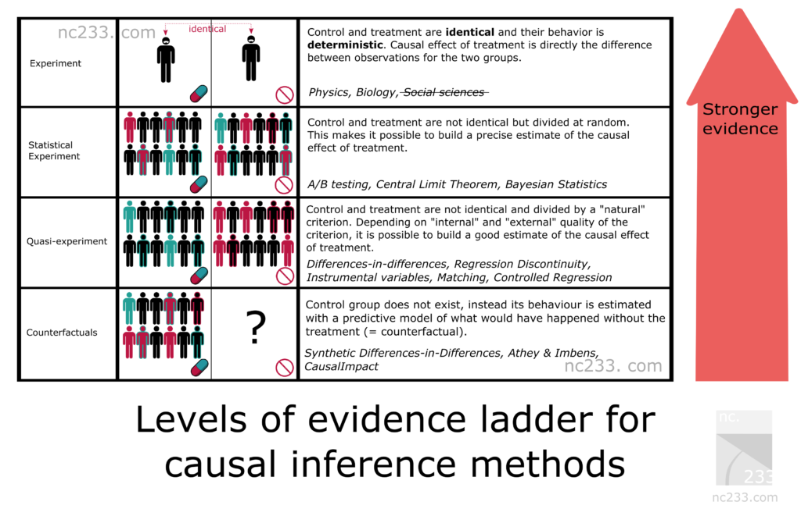
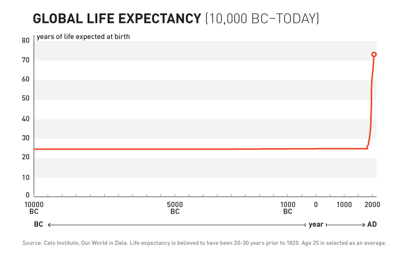
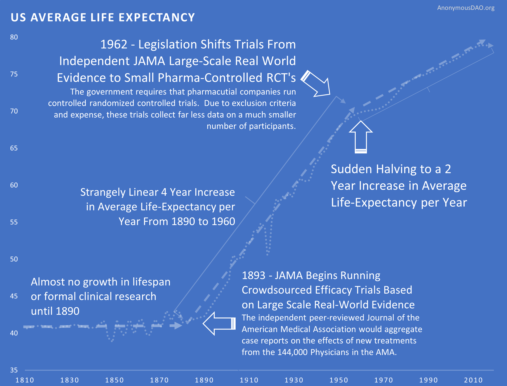

👈 [Back to Table of Contents](../README.md#Whitepaper)
# 2. Solution

The solution is to use the oceans of real-world evidence to discover new cures.

## The Potential of Real-World Evidence-Based Studies
- **Diagnostics** - Data mining and analysis to identify causes of illness
- **Preventative medicine** - Predictive analytics and data analysis of genetic, lifestyle, and social circumstances
  to prevent disease
- **Precision medicine** - Leveraging aggregate data to drive hyper-personalized care
- **Medical research** - Data-driven medical and pharmacological research to cure disease and discover new
  treatments and medicines
- **Reduction of adverse medication events** - Harnessing of big data to spot medication errors and flag potential
  adverse reactions
- **Cost reduction** - Identification of value that drives better patient outcomes for long-term savings
- **Population health** - Monitor big data to identify disease trends and health strategies based on demographics,
  geography, and socioeconomic

## Problems with Historical Observational Research

When people think of observational research, they typically think of correlational association studies.

#### Why It Seems Like Diet Advice Flip-Flops All the Time

In 1977, the USDA warned Americans against the perils of dietary cholesterol. And yet in 1999, TIME released a very different cover, suggesting that dietary cholesterol is fine.

### Correlational is Not The Same as Causation

There are two primary ways of undertaking studies to find out what affects our health:

1. observational studies - the easier of the two options. They only require handing out questionnaires to people about their diet and lifestyle habits, and then again a few years later to find out which habits are associated with different health outcomes.
2. randomized trials - the far more expensive option. Two groups of randomly selected people are each assigned a different intervention.

The largest benefit of randomized trials is that they have the benefit of a "control group". The use of a control
group overcomes the confounding variable problem that plagues observational studies.

A common source of confounding variables in correlational association studies is the "healthy person bias".  For instance, say an observational study finds "People Who Brush Teeth Less Frequently Are at Higher Risk for Heart Disease". It may just be a coincidence caused by a confounding third variable.  People that brush their teeth more are more likely to be generally concerned about their health.  So, the third confounding factor could be that the people without heart disease could also be exercising more or eating better.

However, the massive amount of automatically collected, high-frequency longitudinal data we have today makes it possible for us to overcome the flaws with traditional observational research.

### Overcoming the "No Control Group" Problem

The primary flaw with observational research is that they lack the control group.  The control group consists of the
people who don't receive the intervention or medication in a randomly-controlled trial.  With high-frequency
longitudinal data, a single person can act as their own control group, by using an A/B experiment design.

For instance, if one is suffering from arthritis and they want to know if a Turmeric Curcumin supplement helps, the  experimental sequence would look like this:

1. Month 1: Baseline (Control Group) - No Curcumin
2. Month 2: Treatment (Experimental Group) - 2000mg Curcumin/day
3. Month 3: Baseline (Control Group) - No Curcumin
4. Month 4: Treatment (Experimental Group) - 2000mg Curcumin/day

The more this is done, the stronger the statistical significance of the change from baseline observed. However, there are also effects from other variables, that can be addressed using a diffusion-regression state-space model that predicts the counter-factual response in a synthetic control that would have occurred had no intervention taken place. In contrast to classical difference-in-differences schemes, state-space models make it possible to:

1. infer the temporal evolution of attributable impact
2. incorporate empirical priors on the parameters in a fully Bayesian treatment
3. flexibly accommodate multiple sources of variation, including:
   1. local trends
   2. seasonality
   3. the time-varying influence of contemporaneous covariates

At this time, we apply coefficients representative of each of [Hill’s criteria for causation](http://www.drabruzzi.com/hills_criteria_of_causation.htm) to quantify the likelihood of a causal relationship between two measures as:

* ***Strength Coefficient***: A relationship is more likely to be causal if the correlation coefficient is large and statistically significant.  This is determined through the use of a two-tailed t-test for significance.
* ***Consistency Coefficient***: A relationship is more likely to be causal if it can be replicated.  This value is related to the variation of the average change from baseline for other participants with the same treatment outcome variables in conjunction with the variation in average change from multiple experiments in the same individual.
* ***Specificity Coefficient***: A relationship is more likely to be causal if there is no other likely explanation.  Relationships are calculated based on other potential predictor variables that were available for the individual over the same time period.  The value of the Specificity Coefficient starting at 1 is decreased by the strength of the strongest relationship of all other factors.
* ***Temporality Coefficient***: A relationship is more likely to be causal if the effect always occurs after the cause.
* ***Gradient Coefficient***: The relationship is more likely to be causal if greater exposure to the suspected cause leads to a greater effect. This is represented by the k-means squared difference between the normalized pharmacokinetic time-lagged treatment outcome curves.
* ***Plausibility Coefficient***: A relationship is more likely to be causal if there is a plausible mechanism between the cause and the effect. This is derived from the sum of the crowdsourced plausibility votes on the study.
* ***Coherence***: A relationship is more likely to be causal if it is compatible with related facts and theories. This is also derived from the sum of the crowdsourced plausibility votes on the study.
* ***Experiment Coefficient***: A relationship is more likely to be causal if it can be verified experimentally. This coefficient is proportional to the number of times an A/B experiment is run.
* ***Analogy***: A relationship is more likely to be causal if there are proven relationships between similar causes and effects.  This coefficient is proportional to the consistency of the result for a particular individual with the number of other individuals who also observed a similar effect.

### Meta-Analyses Support of Real-World Evidence

Observational real-world evidence-based studies have several advantages over randomized, controlled trials, including
lower cost, greater timeliness, and a broader range of patients. Concern about inherent bias in these studies,
however, has limited their use in comparing treatments. Observational studies have been primarily used in
situations in which randomized, controlled trials would be impossible or unethical.

However, [meta-analyses](https://www.nejm.org/doi/full/10.1056/NEJM200006223422506) found that:

> when applying modern statistical methodologies to observational studies, the results are generally **not quantitatively or qualitatively different** from those obtained in randomized, controlled trials.

## Evidence in Support of Real-World Evidence

There is compelling historical evidence suggesting that large scale efficacy-trials based on real-world evidence
have ultimately led to better health outcomes than current pharmaceutical industry-driven randomized controlled trials.

For over 99% of recorded human history, the average human life expectancy has been around 30 years.

At the end of the 19th century, the average life expectancy was around 30 years.

In the late nineteenth and early twentieth century, interest in clinical objectivity grew.  The independent
peer-reviewed Journal of the American Medical Association (JAMA) was founded in 1893.  It would gather case reports
from the 144,000 physicians members of the AMA on the safety and effectiveness of drugs. The leading experts in the area of a specific drug would review all of the data and compile them into a study listing side-effect and the conditions for which a drug was or was not effective. If a drug was found to be safe, JAMA would would its seal of approval for conditions it was found to be effective.

The adoption of this system of this crowd-sourced, observational, objective, and peer-reviewed clinical research
was followed by a sudden shift the growth of human life expectancy.  After over 10,000 years of almost no
improvement, we suddenly saw a strangely linear 4 year increase in life expectancy every single year.

This consistent 4 year/year increase continued until around 1962 when the growth rate was abruptly cut in half to a
2 year per year growth rate.  This coincided with the 1962 regulations, it cost a drug manufacturer an
average of $74 million dollars (2020 inflation-adjusted)
to develop and test a new drug for safety before bringing it to market. Once the FDA had approved it as safe, efficacy testing was performed by the third-party American Medical Association.

The 1962 regulations made these large real-world efficacy trials illegal. Ironically, despite the fact that the new regulations were primarily focused on ensuring that drugs were effective through controlled FDA efficacy trials, they massively reduced the quantity and quality of the efficacy data that was collected for several reasons:
New Trials Were Much Smaller
Were Far More Expensive
Participants Were Less Representative of Actual Patients
They Were Run by Drug Companies with Conflicts of Interest Instead of the 3rd Party AMA

This coincided with the 1962 regulations, it cost a drug manufacturer an
average of $74 million dollars (2020 inflation-adjusted)
to develop and test a new drug for safety before bringing it to market. Once the FDA had approved it as safe, efficacy testing was performed by the third-party American Medical Association.

### An Experiment on Experiments

Validation of the theory that large-scale real-world evidence can produce better health outcomes, will require us to run an experiment to validate this method of experimentation.

## A Black Box Approach to Personalized Medicine

Thus, we can treat the human as a black box and apply predictive
machine learning models to all of the existing real-world data to [stratified groups](https://en.wikipedia.org/wiki/Stratified_sampling) of similar people based on their:

- [Genomic](https://en.wikipedia.org/wiki/Genomics)
- [Metabolomic](https://en.wikipedia.org/wiki/Metabolomics)
- [Microbiomic](https://en.wikipedia.org/wiki/Microbiota)
- [Diseasomic](http://ijream.org/papers/IJREAMV05I0250057.pdf)
- [Pharmacomicrobiomic](https://en.wikipedia.org/wiki/Pharmacomicrobiomics)
- [Pharmacogenomic](https://en.wikipedia.org/wiki/Pharmacogenomics)
- [Foodomic](https://en.wikipedia.org/wiki/Foodomics)

profiles. This will enable us to discover the personalized full range of positive and negative for all factors
without a profit incentive for traditional trials.

## Our Current Research

We publish our anonymously aggregated analyses at the [Journal of Citizen Science](https://app.crowdsourcingcures.org/). So far, we’ve collected over 10
million data points on symptom severity and influencing factors from over 10,000 participants. This data has been
used to publish 90,000 studies on the effects of various treatments and food ingredients on condition severity.

### [Next 3. Platform](./3-platform.md) 👉

This work is licensed under a <a rel="license" href="http://creativecommons.org/licenses/by-nc-sa/4.0/">Creative Commons Attribution-NonCommercial-ShareAlike 4.0 International License</a>.

