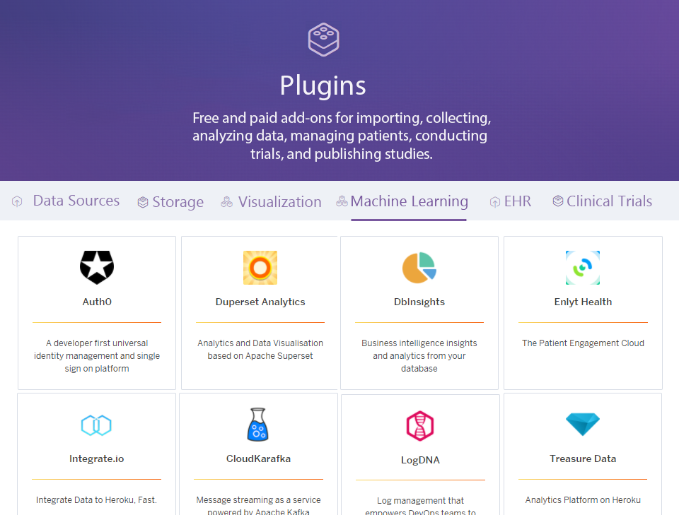

👈 [Back to Table of Contents](../README.md)
# 3. The Platform

This chapter describes the functional description of the proposed software platform and plugin framework to be developed in more detail. Scope is the development is functionalities for the aggregation, managing, processing and storage of health data from different sources.

The goal is to achieve better interoperability, portability, availability, analysis, security of the data and a basic technology layer suitable for a number of applications that can be built on top of it:

- User centered dashboards for personal health management
- Direct to customer and value-based health care
- Data sharing with doctors, health coaches or family members
- Decentralized clinical trial platforms (e.g. BYOD wearables)
- Patient recruitment services for clinical trials
- Citizen science platforms
- Health data marketplaces
- Open health data bases for research
- Algorithm and scores development (e.g. in-silico trials)
- Niche health applications with specific custom requirements or custom integrations

A simplified representation of the architecture is drafted in the following graphic:

The platform consists of two primary components:

- **Core Open-Source Platform** - The core platform will be open-source and include only universally necessary features.  This primarily consists of user authentication, data owner access controls, data storage, data validation, and an API for storage and retrieval.The DAO will compensate contributors to the core platform.
- **Plugin Framework** - Plugins will be modules that provide additional functionality. This includes data import from specific sources, data mapping to various formats, data analysis, data visualization, notifications. These may be free or monetized by their creator or even be integrated into the core based on community voting.

The possibility for developers to easily create plugin modules on top of the core opens up the basis for no-code marketplaces.  
A famous successful example is Wordpress 
and it's plugin ecosystem. A possible implementation of the envisioned plugin marketplace is illustrated in the graphic below:

## 3.1 Core Components

### 3.1.1 Data Ingestion API

In theory any kind of human generated data which can be ingested and used for deriving health insights should be defined as health data and be made accessible for further analysis. 

The challenge is to acquire, extract, transform, and normalize the countless unstandardized data export file formats and data structures and load them into a standardized structure that can be easily analyzed.

Proposed is the development of an application programming interface (API) and OpenAPI specification for receiving and sharing data with the core database.  Software development kits (SDK’s) made available for 3rd party applications allow the interaction with the API. SDK’s will enable developers to implement easy automatic sharing options in their applications. 

Addressed Health Data sources:
- Laboratory and Home tests (Standard Blood panels, Metabolomics, Proteomics, Genetics, Urinalysis, Toxins, etc)
- Wearables (Sleep and Fitness trackers, etc)
- Health apps (Meal tracking, Fertility, etc)
- User reported symptoms and intervention application
- Electronic Heath Records
- Imaging
- Questionnaires
- Functional tests
- Environmental and context data (Exosome)
- Life events, Calendar, Social media and Lifestyle
- Digital biomarkers
- Location

Addressed existing health data formats:
- FHIR
- openEHR
- LOINC
- SNOMED
- RXNORM
- MedDRA
- ICD-10
- Open mHealth

Separate plugins will enable spreadsheet upload/import and scheduled imports from existing third-party APIs. The API connector framework will allow the ongoing regular import of user data after a single user authorization.  

### 3.1.2 Raw Data and Files Storage

To preserve originality in case of data processing errors or protocol changes the ingested raw files like CSV files, PDF reports and the raw API responses are stored separately in a raw data and file storage.
Data will be encrypted and stored in its raw format in flat files on a secure cloud provider defined in the framework instance platform settings.  Preservation of the data in its original format will allow for:

1. Asynchronous Queued Data Parsing Jobs - This is necessary to allow for the data to be parsed in parallel offline and avoid overloading the webserver.
2. Storage of data incompatible with a time-series relational data store.
3. Storage of data formats that do not yet have defined parser plugins.  This will allow for the data to be imported at a later date when the data mapper has been defined.
4. Updating parsers to support changes in the response format for a particular API.

The original raw data and files can be accessed at any time by the owner, independently from any other process involved with the structured data storage.

### 3.1.3 Data Mapping

To make the standardized structured storage of health data and the envisioned queries possible, the data has to be ingested from files or API requests and mapped from many different standards and proprietary formats into a single purpose built definition.
These will be executed in an asynchronous queue to map the raw data to a standardized format and provide it to the validator.  The most common data mappers will be integrated into the core. Less common data mappers will be available as plugins from 3rd party developers. 

Core data mappers (Initial proposal):
- FHIR
- LOINC
- SNOMED 
- RXNORM
- openEHR

The used data standard is built from existing formats with filled gaps of missing definitions and is defined by the database design and the reference definitions mentioned in the next paragraphs. The goal is to make multi-omics data as well as environmental, social and new types e.g. digital biomarkers easily accessible and usable for the mentioned applications.

### 3.1.4. Data Validation

To ensure the quality and consistency of ingested data, the validation in many different aspects is necessary to avoid malformed data entered in the database.

- Allowed biological ranges detect outliers based on value or unit
- Data type checks detect errors from applications or data transfers
- Data deviating from expected formats are filtered
- Duplicated data is ignored

The data validation middleware will validate the data before it is stored in the time series database. The scope is to create this data processing in a peer reviewed and professional way to make this accessible for the use in healthcare and clinical trials.

### 3.1.5. Reference Data Definitions

Mapping data from different formats into a one standardized format suitable for a measurements analysis requires a reference data base with tables of definitions and descriptions to be used by the data mappers and by the API for displaying this information in applications. The type of data to be defined includes biomarkers, health related variables of any kind, interventions, therapies, outcomes, conditions, etc. 

Examples of currently used existing reference databases include LOINC, RXNORM, ICD-10 but are partly not suitable enough and have to be unified for the scope of more efficient data handling and analysis. Especially definitions for environmental factors, natural supplementation or therapies, digital biomarkers and social and lifestyle data sources have a lack of integration.

The proposed solution for overcoming challenges with interoperating with data formats like FHIR is a single Table with all definitions query-able by beforehand mentioned categories and types. The main reason for this solution is the complexity of the nature of the definition of a health related measurement, that can be a observation, a intervention or an predictor. Being the input or the status or the output of the black-box system human body is not that strictly definable always, so all measured values are thrown in one "pool" and can be queried according to the needs of analysis without having to worry about the aggregation of the data.

### 3.1.6. Time Series Data Storage

After validation and mapping, the data will be stored in a purpose designed database. The storing of standardized and structured time series data requires a purpose built database design to make data access and analysis queries efficient and scalable. Especially with value attachment, decentralized storage and big data in mind the architecture and technology stack used needs to be carefully selected and tested.

Functional Requirements:
- Large scale data storage for time-series data
- Standardized format
- Atomicity
- Data veracity
- Compatibility with value pointing
- Compatibility with decentralized storage
- Safety and Security

This core feature is the center of functionality and used for central storage of platforms or for decentralized storage for users privately.

### 3.1.7. Data Ownership Management

Data should be owned by the individual who generated it. 
It should remain under their control throughout the entire data life-cycle from generation to deletion. 
The data owner shall have the unrestricted ability to manage their digital health identity.

Ownership management functionalities will allow the individual to manage their data and access control settings for sharing purposes. It will allow them to:

- View and Access their data
- View the OAuth clients with access to the data
- Modify read/write permissions for specific OAuth clients
- Restrict data access to specific users, groups, researchers or applications
- Restrict data access to specific data categories, types and markers
- Restrict time and expiration of data access
- Configure security measures such as encryption or 2-factor authentication
- Overview of statistics of data (amount, averages, sources, etc..)
- Export stored data or the original files
- Delete data

This feature can be used by user centered applications and dashboards for personal health management, for data sharing with care providers, research or for participation in trials.

### 3.1.8. Data Value Stream Management

Health data is a sensitive and valuable commodity. 
Many businesses profit from the direct use or further processing of this data including the individual himself. 
Therefore the handling of the data alongside its attached value is proposed to be built natively into the core.
Value stream management functionalities will allow the exchange from data against tokenized value assets in different scenarios. It will allow:

- Individuals to share data and receive defined compensation
- Groups create and attach insights from grouped data sets to values and exchange to buyers against value assets
- Researchers apply, formulate and visualize values of data sets
- Connect data to value in general for administration purposes
- Applications to create a value based feedback loop for research or behavioral outcomes

Data Value Scenarios:
- Raw data sets or streams of individuals 
- Cohort raw data sets of grouped individuals 
- Interpreted data, scores and recommendations 
- Generated insights and IP out of data analysis
- Specifically aggregated data according requested needs from buyers
- Phenotypic, demographic, lifestyle, conditions, environmental context

This feature can be used for exchanging data on marketplace applications or clinical trial platforms.

## 3.2 Plugins

Defined interfaces will allow 3rd party development of software modules that interact with the core and provide additional functionality. They may be free or monetized by their creator. 

Plugins will be stored in their own repositories based on a plugin template repository. The plugin template
repository will contain defined interfaces required for interoperability with the core.

### 3.2.1 Data Analysis Plugins

The impact of effective and detailed analysis is 
- the discovery of root causes of disease
- development of new interventions 
- the precise and personalized application of these interventions

Data Analysis Plugins will apply statistical and machine learning methods to the ocean of high-frequency 
longitudinal individual and population level data. The resulting value will include:
- Personalized Effectiveness Quantification - Determination of the precise effectiveness of treatments for specific individuals
- Root Cause Analyses - Revelation of hidden factors and root causes of diseases
- Precision Medicine - Determination of the personalized optimal values or dosages based on biomarkers, phenotypes and demographics
- Combinatorial Medicine - Discover relationships between variables or combinations of interventions
- Effect Size Quantification - Quantification of effect sizes of all factors on symptom severity
- Optimal Daily Values - Determination of the personalized optimal dosages of nutrients or medications
- Cost-Benefit Analysis - Determination of the most cost-effective interventions by weight clinical benefit against costs in terms of side effects and financial impact

This will mitigate the incidence of chronic illnesses by informing the user of symptom triggers, such as dietary sensitivities, to be avoided. This will also assist patients and clinicians in assessing the effectiveness of treatments despite the hundreds of uncontrollable variables in any prescriptive experiment.

Large cohort clinical analysis could reveal new molecules for longevity.

### 3.2.2 Data Visualization Plugins

Data visualization modules are utilized to visualize the data from individual or multiple subjects or markers to make insights and correlation visible and understandable to the human. The task of such a plugin is to query the data pools with defined filters such as time frames to get to defined data sets and transform them into formats readable by e.g. frontend charting libraries. Some regular ways to visualize data are Scatter plots, timeline charts, heatmaps or novel ways like the in the following proposed outcome labels. Visualizations can be displayed in studies, publications or to the end user.

Tasks of data visualisation plugins:
- Query the database according to filters and sorting commands
- Handle the processing of data processing functions like statistical analysis
- Map the data into a simpler format suitable for frontend visualisation libraries

#### Example Visualization Plugin

Currently, all foods carry nutrition labels such as this one:

But how useful is it to the average person to know the amount of Riboflavin in something? The purpose of nutritional labels is to help individuals make choices that will improve their health and prevent disease.

Telling the average person the amount of riboflavin in something isn’t going to achieve this. This is evidenced by the fact that these labels have existed for decades and during this time, we’ve only seen increases in most diseases they were intended to reduce.

We have created a new and improved **Outcomes Label** that instead lists the degree to which the product is likely to improve or worsen specific health outcomes or symptoms. 
We currently have generated Outcome Labels for thousands
of foods, drugs, and nutritional supplements that can be found at [Journal of Citizen Science](https://studies.crowdsourcingcures.org/). These labels are derived from the analysis of 10 million data points anonymously donated by over 10,000 study participants via [our web app](https://app.crowdsourcingcures.org/?swcfpc=1#/app/intro).

#### Data Quantity Required for Outcome Labels

The Foundation has collected over 10 million data points on symptom severity and influencing factors from over 10,000 people. The Foundation develops and applies predictive machine learning algorithms to the data to reveal the effectiveness and side-effects of treatments and the degree to which hidden dietary and environmental improve or exacerbate chronic illnesses

These analytical results have been used to freely publish 90,000 studies on the effects of various treatments and food ingredients on symptom severity.

Although 10 million data points sound like a lot, currently, the usefulness and accuracy of these Outcome Labels are currently limited. This is due to the fact there are only a few study participants have donated data for a particular food paired with a particular symptom. In observational research such as this, a very large number of participants are required to cancel out all the errors and coincidences that can influence the data for a single individual.

For instance, someone with depression may have started taking an antidepressant at the same time they started seeing a therapist. 
Then, if their depression improves, it’s impossible to know if the improvement was a result of the antidepressant, the therapist, both, or something else. 
These random factors are known as confounding variables. 
However, random confounding factors can cancel each other out when looking at large data sets. 
This is why it’s important to collect as much data as possible.

#### Data Sources for Outcome Labels

Several types of data are used to derive the Outcome Labels:

1. **Individual Micro-Level Data** – This could include data manually entered or imported from other devices or apps in [our app](http://app.crowdsourcingcures.org/?swcfpc=1), This could also include shopping receipts for foods, drugs, or nutritional supplements purchased and insurance claim data.
2. **Macro-Level Epidemiological Data** – This includes the incidence of various diseases over time combined with data on the amounts of different drugs or food additives. This is how it was initially discovered that smoking caused lung cancer. With macro-level data, it’s even harder to distinguish correlation from causation. However, different countries often enact different policies that can serve as very useful natural experiments. For instance, 30 countries have banned the use of glyphosate. If the rates of Alzheimer’s, autism, and depression declined in these countries and did not decline in the countries still using glyphosate, this would provide very powerful evidence regarding its effects. Unfortunately, there is no global database that currently provides easy access to the incidence of these conditions in various countries over time and the levels of exposure to various chemicals.
3. **Clinical Trial Data** – This is the gold standard with regard to the level of confidence that a factor is truly the cause of an outcome. However, it’s also the most expensive to collect. As a result, clinical trials are often very small (less than 50 people). Exclusion criteria in trials often prevent study participants from being representative of real patients. There are ethical considerations that prevent us from running trials that have any risk of harm to participants. Due to the expense involved, we have very few trials run on anything other than a molecule that can be patented and sold as a drug.

### 3.2.3 Application Programming Interface (API) Connector Plugins

Many applications and service providers offer a direct exchange of structured health data through an API, which upon user authentication allow access to automated and scheduled exports of the generated data.

So far the proprietary silo developments have produced many different data formats, which could be replaced with the data standard proposed within this project. 
Until the success of a common language for all type of health data and between all stakeholders, many API connecting plugins are necessary for this interoperability.

An API connector plugin handles:
- User interface and tokens for authentication and authorization with the 3rd party applications
- Automation and the periodic fetching of health data
- Mapping to the standard specification
- Providing the responses to the origin raw storage module

This type of plugins also takes care of the error handling and the communication with the user within this multiple step process.

#### Connector Technical Flow

API Connector plugins will be called by the webserver to:

1. handle the OAuth2 authorization flow and store their credentials in the relational database
2. provide the original raw response to the core platform for encryption and storage

A job scheduler will call the API connectors periodically (usually daily) to:

1. Refresh the user's OAuth access token
2. Fetch new data or data that has been modified since the last import
3. Map the response to the standard format as defined by the OpenAPI specification for the framework API
4. Provide the processed data to the framework's validation middleware.
5. All valid data will be stored in the relational database. Otherwise, the data will be rejected and the plugin developer and data owner will be notified.

### 3.2.4 File Importers

File importing plugins are needed for specific source or devices, where APIs are not available and the user only has access to raw files.
Types of files include spreadsheets, PDFs, and raw genomic data.

1. The file passed by an upload action to the data importer plugin user interface on the frontend application 
2. The core framework will encrypted and store the raw file
4. The file id and importer plugin id will be added to a queue for processing by the job scheduler

The background job scheduler will:
4. Retrieve the file from the encrypted storage
5. Pass the file to the matching file importer plugin
6. The importer plugin will extract the data from the file
7. The importer plugin will map to the standard format as defined by the framework OpenAPI specification
8. The processed data will be provided to the framework's validation middleware.
9. Valid data will be stored in the relational database.
10. Invalid data from the importer plugin will be rejected and the plugin developer and data owner will be notified.

A link between the created structured data and the original file allows backup and reprocessing (e.g. if the data 
import plugin functionality is expanded in future versions).

Challenges include changing proprietary formats, spreadsheet column matching, long upload times with raw files like from genomic testing.

### [Next Incentivization](./4-incentivization.md) 👉

This work is licensed under a <a rel="license" href="http://creativecommons.org/licenses/by-nc-sa/4.0/">Creative Commons Attribution-NonCommercial-ShareAlike 4.0 International License</a>.

