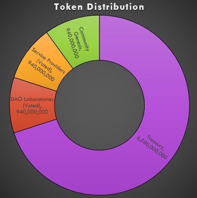

# 🪙 Tokenomics

👈 [Back to Table of Contents](../)

The $dCURES token is the economic driver of the CureDAO platform. $dCURES is obtained by contributing work, data, IP, or funds to CureDAO. The core function of $dCURES is to incentivize data sharing and open-source collaboration.

dCURES tokens grant [Citizen Scientists](5-organization.md) the right to decide:

1. How data will be monetized
2. How the platform will be monetized
3. How contributors to the platform will be compensated
4. How the platform is architected
5. The terms on which strategic partnerships will be created
6. Which Gitcoin Grants or Bounties receive funds
7. What IP contributors will receive funds and how much
8. How internal [DAO Laboratories](5-organization.md) budgets and projects are funded
9. How CureDAO is governed
10. How the CureDAO treasury will be managed

## Token Genesis

30% of the total supply will go to the community during the initial genesis, and 70% remain unminted and available in CureDAO’s treasury to ensure the sustainability of the platform. Members may elect to issue further tokens at any time to the public or select strategic entities and funders. Furthermore, CureDAO may allocate tokens to various incentive mechanisms as proposed herein or by the community.

### Token Supply and Distribution

The goal of CureDAO is for every human on earth to share the natural experiments that define their existence. The world’s population is projected to peak at 9.4 billion around 2070. To enable everyone to become a [Citizen Scientist](5-organization.md), upon genesis, 9.4 billion $dCURES tokens will be created as ERC20 tokens controlled by CureDAO. CureDAO’s token begins unable to exceed that number - it is a capped ERC20 token. Our core collective mission at This token supply may only increase if the world population exceeds 9.4 billion.

The genesis distribution event will make 10% of CureDAO’s total token supply available to interested participants using a fair and open smart contract auction on the Ethereum blockchain.

| Token Quantity | Fraction of Total | Recipient                 |
| -------------- | ----------------- | ------------------------- |
| 940M           | 10%               | Community Genesis         |
| 940M           | 10%               | Service Providers (Voted) |
| 940M           | 10%               | DAO Laboratories (Voted)  |
| 6.58B          | 70%               | Treasury                  |
| **9.4B**       | **100%**          | **Total**                 |

Since CureDAO’s genesis operates via a public auction, the community decides the initial token price. We estimate a minimum of $5,000,000 will be required to support the first iteration of the platform.

CureDAO will be fully decentralized and community-owned from inception. No entity will own $dCURES tokens before the genesis contribution event.

dCURE’s genesis contribution event will run via a fair launch public auction, granting all successful auction participants equal governance rights per $dCURES. Once issued the first 10% of tokens, the CureDAO core community will begin voting on the first governance proposals to allocate additional tokens to DAO Laboratory working groups and service providers.

The approval of these allocations to [DAO Laboratories](5-organization.md), contributors, and service providers is at the full discretion of genesis [Citizen Scientists](5-organization.md) and their approval. They form the core of CureDAO’s decision-making and executive body.

## References


[Mint Club](https://mint.club) is a smart token building platform that has no need to code and provides instant liquidity.&#x20;



The Augmented Bonding Curve (ABC) aligns the incentives of a community to support an underlying public good. It creates the seed funding that will be used to achieve the goal of the Commons, and acts as the interface between the internal economy of the Commons and the outside world.


#### [Next Revenue](7-revenue.md) 👉

This work is licensed under a [Creative Commons Attribution-NonCommercial-ShareAlike 4.0 International License](http://creativecommons.org/licenses/by-nc-sa/4.0/).
