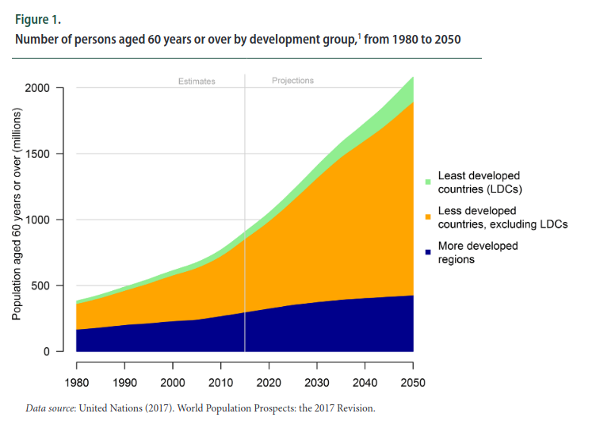
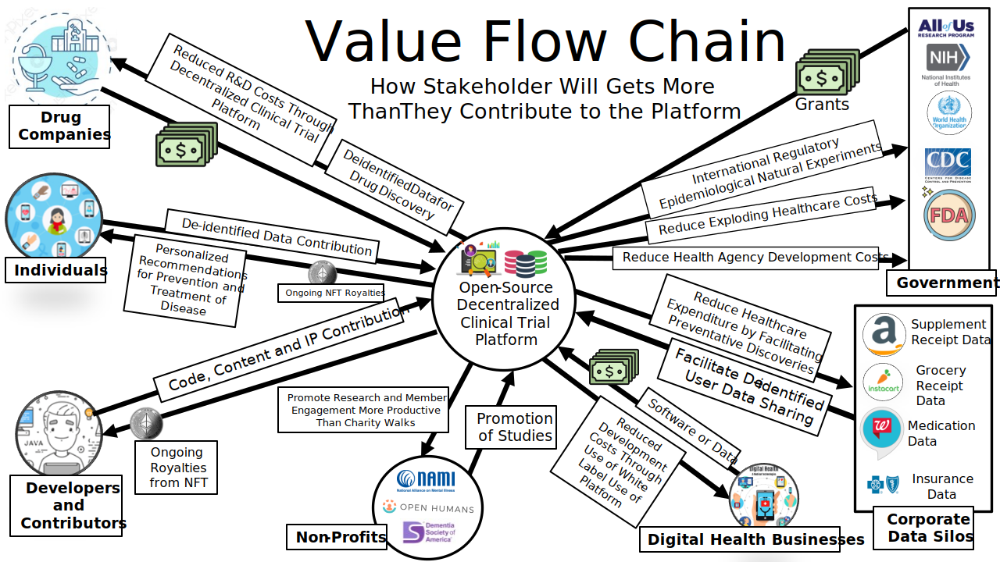

# 💰 Revenue

👈 [Back to Table of Contents](../)

## Revenue

The biotech and pharmaceutical industries are two of the fastest growing sectors of the U.S. economy. 

This growth is likely in part due to two main factors:

* the rise of the novel coronavirus has increased the attention and importance of pharmaceutical development
* the number of persons older than 60 is expected to more than double in the coming decades

These factors all point to a massive potential for the revenue necessary to sustain this project. The primary sources of revenue include:

1. Sale of high-frequency longitudinal de-identified data to
   1. pharma for drug discovery
   2. research institutions for funded studies
2. Grants from governments modernizing their programs to take advantage of real-world data
3. Digital health companies wishing to accelerate product development using existing white-label software or hosted software-as-a-service (SaaS) options

### Hosted Software as a Service (SaaS)

Digital health companies can save months of development time and tens of thousands of dollars by using our platform instead of reinventing the wheel. A usage-based subscription platform for health application developers would start at $0.50/end-user per month.

### Sponsored Apps

106,000 people die annually in the U.S. from properly prescribed drugs. The number of people having in-hospital, adverse reactions to prescribed drugs to be 2.2 million per year. The total number of deaths caused by conventional medicine is 783,936 per year. Pharmaceutical companies spend over $2 billion a year on over 314,000 events attended by doctors.

Initial sponsor applications focus on tracking adverse reactions to the medications known to produce the most adverse reactions. Using our treatment, and symptom tracking application can reduce the number of deaths and costs of intervention by alerting patients and their practitioners to conditions before they become irreversible. Additionally, the opportunity to meet and promote these applications to physicians would also serve as a novel new way for pharmaceutical manufacturers to connect with physicians.

This technology can also be used to dramatically drive down the costs of pharmaceutical post-marketing research.

Sponsor apps using the platform can be provided to hospitals, insurers, and pharmaceutical companies who wish to improve patient outcomes and potentially gather patient-authorized anonymized patient data.

Pricing would follow a subscription model starting at $2 per end-user per month.

### Data Licensing

Electronic health records (EHRs) can be used to support randomized controlled trials (RCTs). A \[meta-analysis] (https://pubmed.ncbi.nlm.nih.gov/30718353/) found that the per-patient cost in EHR-supported trials varied from [$44 to $2000](https://pubmed.ncbi.nlm.nih.gov/30718353/). Using NFTs we can link donated data to the patient so that they may receive ongoing royalty payments for the use of their data once new interventions reach the market. A fraction of the revenue, to be determined democratically by the patients and DAO Citizens, may be directed to the DAO treasury to sustain the project.

### Software Licensing

Although the project core framework will be open-source for any non-commercial purpose. However, we will utilize a [Fair-code](https://faircode.io) or [Fair Source](https://fair.io/?a) licensing model to generate revenue when utilized by for-profit entities. Licensing fees will be negotiated such that a fraction of the profits generated by the licensee's use of the project.

This will ensure that anyone can afford to use it, while still providing compensation to the developers of the platform.

### Plugin Marketplace

### References

1. [World Population Ageing (un.org)](https://www.un.org/en/development/desa/population/publications/pdf/ageing/WPA2017\_Highlights.pdf)
2. [Historical (Compounded Annual) Growth Rates by Sector](https://pages.stern.nyu.edu/\~adamodar/New\_Home\_Page/datafile/histgr.html)
3. [Projected Sector Growth Rates - Google Sheets](https://docs.google.com/spreadsheets/d/1p1\_MOl7jD1fx\_OxFrHSAxTi2zu0tH2CBUM9MuL-kGco/edit#gid=0)
4. [Current use and costs of electronic health records for clinical trial research: a descriptive study - PubMed (nih.gov)](https://pubmed.ncbi.nlm.nih.gov/30718353/)
5. [Fair Source License](https://fair.io/?a)
6. [Fair-code (faircode.io)](https://faircode.io)

#### [Next Legal Framework](8-legal-framework.md) 👉

This work is licensed under a [Creative Commons Attribution-NonCommercial-ShareAlike 4.0 International License](http://creativecommons.org/licenses/by-nc-sa/4.0/).
