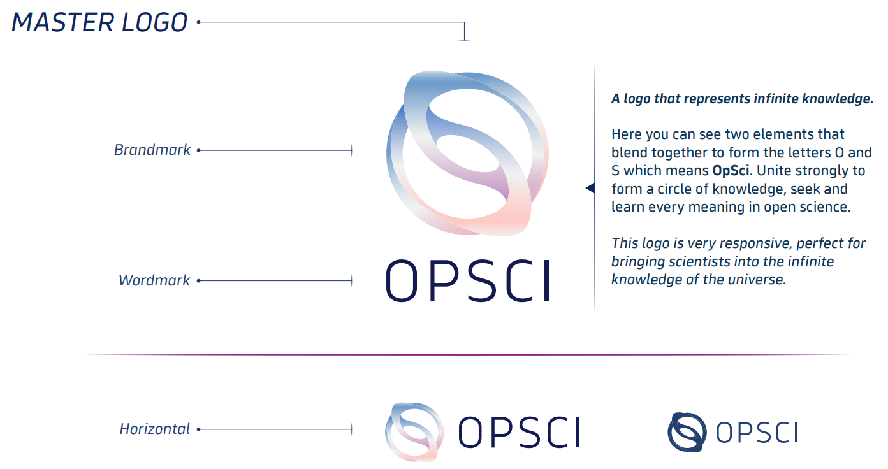
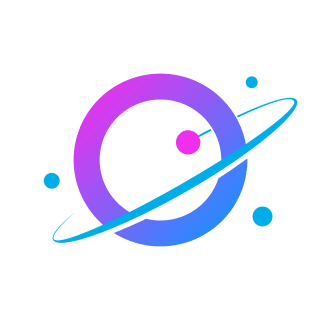

# 🎨 CureDAO Brand Guide Challenge

### [Concept Vote Results](./assets/logo-concept-vote-results.pdf)

## Project Overview

***

CureDAO is a decentralized autonomous organization (DAO) of scientists, governments, businesses, and nonprofits devoted to the minimization of suffering. To achieve this, we propose the creation of an open-source framework that overcomes the traditional economic & time barriers in the field of digital health.

Ultimately, our vision is the realization of a global artificial intelligence that will aggregate and analyze data from every human being. It will then use this to provide personalized guidance on alleviating and preventing chronic diseases.

It is important to solidify our brand image to communicate this mission and inspire the participation of all humans.

The CureDAO brand will continue to be optimized through experimentation and the collection of marketing data.

### Goals

⭐ Communicate our vision of a global artificial mind that will provide personalized guidance on alleviating and preventing chronic diseases.

⭐ Create a completely unique, attention-grabbing, and memorable icon that reminds people of the organization's name and purpose

⭐ Inspire people to join the CureDAO movement to end suffering

## Audience

***

_Who are we talking to?_

* Human participants with health data
* Organizations that would like to use the platform, such as pharmaceutical companies or digital health companies
* Developers or contributors to the project

### Voice & Tone

_How are we talking to them?_

* Friendly
* Scientific
* Persuasive
* Futuristic
* Authoritative

### Deliverables

1. Vector image files (SVG, AI, or FIG) containing
2. MASTER LOGO
    1. Brandmark - A unique and attention-grabbing icon that will bring the name CureDAO to mind and that conveys the vision above (ideally with letters C D incorporated).
    2. Wordmark - The text "CureDAO" in open source font
    3. Horizontal - Wide logo with the text "CureDAO" and the image combined
3. Font Files
4. Color Palette
5. Website landing page

## Example Brand Guide

[Click to See Awesome OpenSci Brand Guide Example](./assets/BRAND\_GUIDE\_OPSCI\_1.pdf)

## Definitions

## Example Logos From Successful Projects

Feel free to add more here.

## Timeline

* Submission Deadline - 3/31/2022
* Voting Period - 4/1/2022 - 4/5/2022 - Voting will be done using a rank-choice voting methodology

### Awards

* Winner - $500
* Runner-Up - $100
* Honorable Mentions - $50
