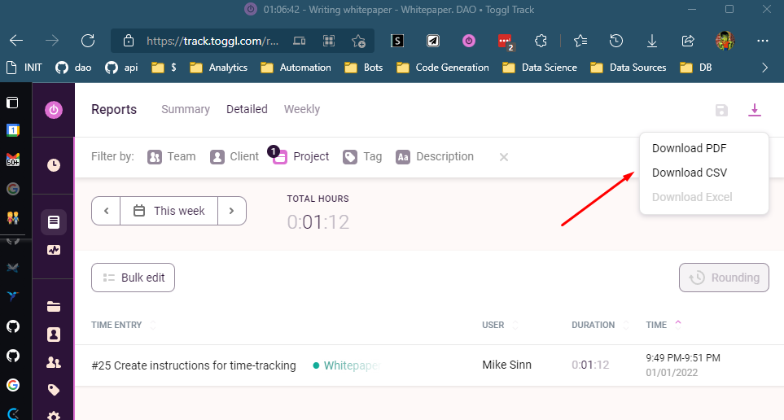

# How to Contribute

1. Submit name, tagline, token name, and logo ideas 👉 [here](https://forms.gle/S4SbV3VUR7JgXEScA)
2. Track your time with Toggl and submit your weekly timesheet to the DAO
3. Complete Gitcoin bounties

## Time-Tracking

Toggl is a free and [open source](https://github.com/toggl/track-extension) time tracking app that you can use to track time spent on our GitHub Issues:

**Download the plugins here:**

[Toggl Track extension for Google Chrome](https://chrome.google.com/webstore/detail/toggl-track-productivity/oejgccbfbmkkpaidnkphaiaecficdnfn)

[Toggl Track extension for Firefox](https://addons.mozilla.org/en-US/firefox/addon/toggl-button-time-tracker)

## GitHub Integration Setup

A step-by-step guide on how to integrate Toggl Track with GitHub

#### Add the free extension to your browser

Download the Toggl Track extension and install it. Click [here](https://chrome.google.com/webstore/detail/toggl-track-productivity/oejgccbfbmkkpaidnkphaiaecficdnfn) to get the Chrome extension and [here](https://addons.mozilla.org/en-US/firefox/addon/toggl-button-time-tracker/) for the Firefox extension.

#### Log in to Toggl Track & close the tab

The extension should now appear in your taskbar. Click on it and login into your Toggl Track account. If you do not have one, you can sign up for free [here](https://toggl.com/track/signup/). Integration with GitHub works with a free account.

#### Enable the integration in the Settings page

Click on the cogwheel icon to access the Settings page. In the Integrations tab, search for GitHub and select it to enable the integration. Your changes are immediately saved.

#### Start the timer in GitHub

Head over to GitHub. You should now see a Toggl Track icon in the user interface. Clicking on it will open a popup where you can start the timer, add a time entry description, project or tags. You are now tracking time!

#### View and export time reports in Toggl Track’s web app

Head over to [track.toggl.com](https://track.toggl.com/) to export a time report. 

#### Submit Hours

1. Create an [issue on GitHub](https://github.com/cure-dao/draft-whitepaper/issues/new).
2. Add tag `timesheet`
3. Assign `cure-dao-human`
4. Attach the report by clicking the picture button and selecting the file
