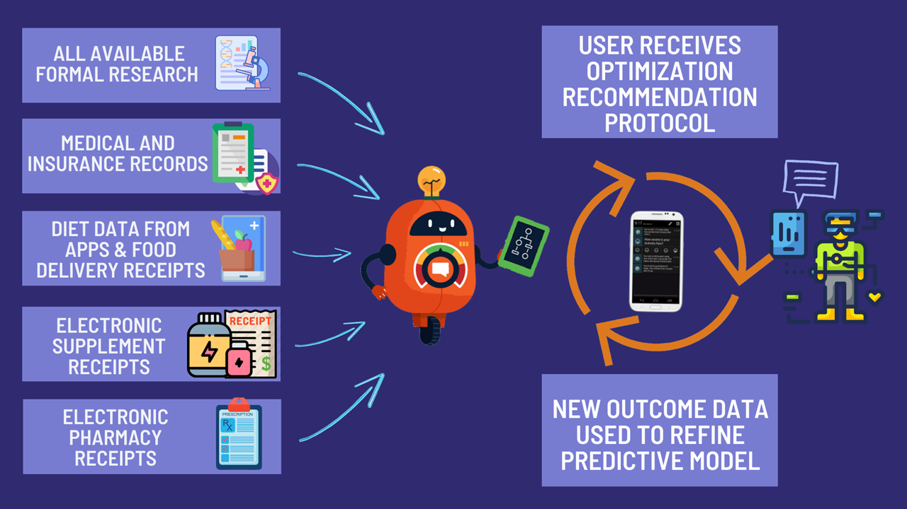

# Optomitron Real-Time Decision Support Plugin
A personalized AI assistant that analyzes your data to inform you of the most effective things you can do to improve 
your life.

### [DEMO VIDEO](https://youtu.be/hd50A74o8YI)

# References

1. [SunilDeshpande_S2014_ETD.pdf (asu.edu)](https://keep.lib.asu.edu/_flysystem/fedora/c7/114023/Deshpande_asu_0010E_14022.pdf)
2. [LocalControl: An R Package for Comparative Safety and Effectiveness Research | Journal of Statistical Software (jstatsoft.org)](https://www.jstatsoft.org/article/view/v096i04)
3. [bbotk: A brief introduction (r-project.org)](https://cran.r-project.org/web/packages/bbotk/vignettes/bbotk.html)
4. [artemis-toumazi/dfpk (github.com)](https://github.com/artemis-toumazi/dfpk)
5. [miroslavgasparek/MPC_Cancer: Model Predictive Control for the optimisation of the tumour treatment through the combination of the chemotherapy and immunotherapy. (github.com)](https://github.com/miroslavgasparek/MPC_Cancer)
6. [Doubly Robust Learning — econml 0.12.0 documentation](https://econml.azurewebsites.net/spec/estimation/dr.html)
7. [AGUILAR-SENIORTHESIS-2019.pdf (harvard.edu)](https://dash.harvard.edu/bitstream/handle/1/37366470/AGUILAR-SENIORTHESIS-2019.pdf?sequence=1&isAllowed=y)
8. [A control systems engineering approach for adaptive behavioral interventions: illustration with a fibromyalgia intervention (nih.gov)](https://www.ncbi.nlm.nih.gov/pmc/articles/PMC4167895/)
9. [The promise of machine learning in predicting treatment outcomes in psychiatry - Chekroud - 2021 - World Psychiatry - Wiley Online Library](https://onlinelibrary.wiley.com/doi/full/10.1002/wps.20882)
10. [CURATE.AI: Optimizing Personalized Medicine with Artificial Intelligence - Agata Blasiak, Jeffrey Khong, Theodore Kee, 2020 (sagepub.com)](https://journals.sagepub.com/doi/full/10.1177/2472630319890316)
11. [Using nonlinear model predictive control to find optimal therapeutic strategies to modulate inflammation (aimspress.com)](https://www.aimspress.com/article/id/2665)
12. [Forecasting Treatment Responses Over Time Using Recurrent Marginal Structural Networks (nips.cc)](https://papers.nips.cc/paper/2018/hash/56e6a93212e4482d99c84a639d254b67-Abstract.html)
13. [Estimating counterfactual treatment outcomes over time through adversarially balanced representations | OpenReview](https://openreview.net/forum?id=BJg866NFvB)
